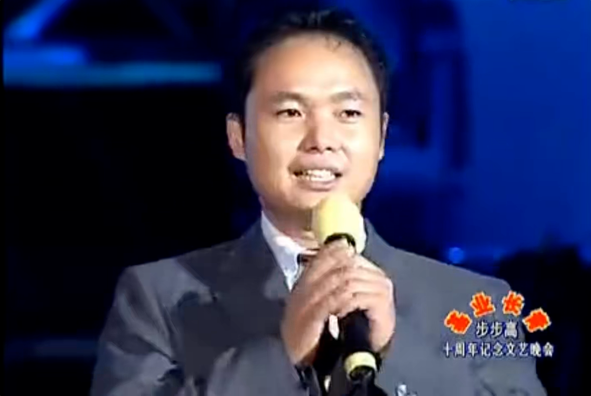

# 2005-陈明永-步步高十周年记念文艺晚会讲话

> URLs:  https://www.bilibili.com/video/BV17E411o76P     
> Link:      
> Category: #1-核心-公司里程碑     
> Tag:  #平常心 #本分 #做正确的事 #诚信      

朱军兄刚才所讲的东西，我觉得很朴素，但是也是我们本分的一个部分。我们步步高企业创业十年以来，在企业的不同发展阶段，我们的总经理阿段讲述企业价值观，讲的最多的就是本分。  

本分是我们企业核心价值观的中心，在这个地方我想讲讲我在他的训导下的一点理解，本分实际上是跟做正确的事情相联系的，在企业的经营过程中，做正确的事情是至关重要的。如果我们做的事情本来就不对的话，那再怎么努力，最后的结果也是必然不会成功。可见做正确的事情是很重要的。但是，做正确的事情，确实不容易的。  

因为我们每一个人以及我们的企业是生存在一个充满诱惑、压力、挑战等各种力量相互作用的环境之中。我们会受到这些力量的左右，它会让我们变得彷徨，变得焦躁不安，以致会做出错误的判断决策。这样的结果就会做错误的事情。本分在这种情况下就起到作用了。本分就是当我们身处在这样的环境之中，在我们判断决策行动的时候，我们把环境给予我们的压力、诱惑等这些外力的先行的抛开，在很平常的心态下回归到事物的最基本面，思考我们本来应该干什么事情，合理的方向在哪？牢牢的把这些东西把握住，坚守住，然后再考虑外力对我们的影响。在这整个过程中，我们所秉持的这种积极的正确的心态就是本分。  

本分在我们企业有许多意义上的延伸。比如说我们要保持平常心，我们要诚信。我们在商业活动中，我们要坚守商道，道是道理的道，而不是术，那么要重视道而不是重视术，我们在商业竞争的时候，我们要尊重我们的对手，而不是攻击和诋毁我们的对手。当我们的团队遇到困难出现问题的时候，我们每一个成员首先要求责于己，也就要先找自己的问题，而不是指责对方等等这些。  