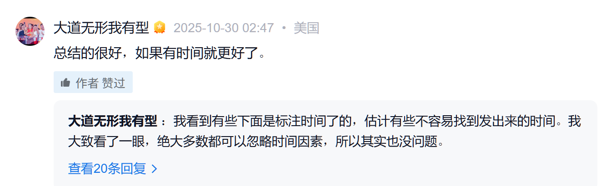

# 2020（推测）-OPPO 企业文化

> URLs: https://xueqiu.com/7667646479/358696609       
> Link:      
> Category: #1-核心-公司里程碑     
> Tag:  #平常心      

**第一条：使命**  

科技为人，以善天下。  

**第二条：愿景**  

成为更健康、更长久的企业。  

**第三条：价值观**  

本分、用户导向、追求卓越、开放。  

**本分**  

• 隔离外在的压力和诱惑，**保持平常心**，回归事物的本源，**做正确的事情**。  

• **保持专注，聚焦最重要的事情**。  

• 本分是要求自己而不是要求别人，当出现问题时，首先**求责于己，主动担当**。  

• **我不赚他人便宜，与伙伴实现长期共赢**。  

• 本分高于诚信，即使没有承诺，本来应该做的事情也要做到。  

**用户导向**  

• **一切活动都要为用户创造价值**，让用户有真实的获得感。  

• 深入一线，倾听并**洞察用户需求**。  

• 通过关键技术解决关键问题，满足用户核心需求。  

• 围绕全生命周期，持续服务用户。  

**追求卓越**  

• 热爱产品，致力于打造伟大产品。  

• **抓住用户最在意的地方，并把它做到极致，追求产品整体的卓越**。  

• 秉持工匠精神，关注细节，对产品和体验持续不断推敲、打磨、优化。  

• 挑战自我，挖掘潜能，始终追求更高的目标。  

• 结果导向，以终为始，突破客观条件限制，整合资源达成结果。  

**开放**  

• 保持批判性思考，从不同维度分析和洞察问题，以抓住事物本质。  

• **敢于表达不同观点，乐于倾听不同意见**。  

• 保持同理心，尊重差异与多元文化。  

• 能够站在更高的层面，更宽的视野上，主动和周边交流协同，**乐于分享与成就他人**。  

**第四条：产品主义**  

• 把打造伟大产品作为一种信仰，打造伟大产品是OPPO长期成功的唯一路径。  

• 崇尚极致的用户体验，**通过设计与技术定义体验，给用户带来真实的获得感**。  

• 为打造伟大产品而兴奋，挑战当下的不可能，并以此为乐。  

• 对做出好产品**心存敬畏**。  

• **奉行精品路线，反对“机海”战术，少即是多**  

  
  ---

