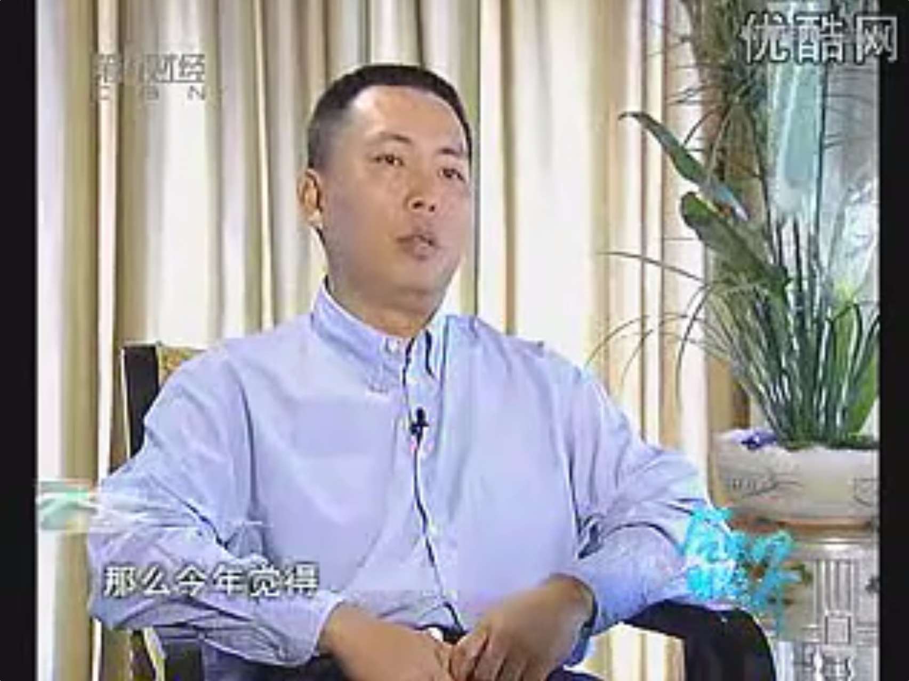

# 2006-秦朔专访[[段永平]]

  

（声明：转录文稿未经逐字人工校对，仅供参考，文本中可能存在错误、遗漏或不准确之处，一切内容请以原视频为准。）

**00:00** 【秦朔】  
全世界第二富有的人，美国股神[[巴菲特]]，每年都通过竞标午餐的方式，为旧金山的一个慈善组织募款。今年竞标的中标者，是中国商界的风云人物，曾经打造了小霸王和[[步步高]]两大品牌的段永平先生。他以62万美金的价格，竞得了这场天价的午餐，同时呢，也成为社会的焦点人物。《会见财经界》今天就请到了段永平先生。  

**00:27** 【片头及音乐】  

**00:36** 【秦朔】  
老段，我们很多年都没有见面了，我也是最近看到这个报道呢，才又想起了你。那么你是什么时候这个关注到这个竞拍？因为这个竞拍好像是2000年开始，你是2001年移居美国的。  

**00:50** 【段永平】  
大概两三年前就有这个想法，但是觉得自己的语言能力不够，所以呢，就一直没有想去。那么今年觉得，主要是想通了一个事情，就是说，我的语言再如何进步也不可能进步成象美国人讲得那么好啊、听得那么好啊，所以我想其实也不会有太本质的差别。那么我现在觉得把自己也过得去，所以就决定今年去。  

**01:17** 【秦朔】  
今年的这个午餐的竞标其实竞争很激烈，我们感到就是有，拍了一共九天，一开始的起价是两万五，也有不少人参加，最后62万美金。这个过程中你是在哪里操作这个过程？  

**01:30** 【段永平】  
我其实只放过两次价钱。那么eBay的规矩就是说，你放一个最高价，你放一个你自己的最高价，人家只要不超过你的价钱之前呢，无论他出什么价钱呢，eBay会自动地加上100块钱。那么我就放过两次，就是我自己认为它应该值的价钱。  

**01:50** 【秦朔】  
第一次你放了多少？  

**01:51** 【段永平】  
第一次我放的时候是50万（美金），那第二次就放了65万（美金）。所以所谓激烈，这个都是一个故事了，因为跟我都没关系，我放完我就不管了。  

**02:01** 【秦朔】  
那你现在那个竞得以后，跟他们巴菲特那方面联系上了吗？定下来时间什么时候去吃了？  

**02:06** 【段永平】  
还没有最后确认。因为我这边还有很多人呢，他自己的行程呢也都比较忙，大家要凑一个大家都正好有空的时间。  

**02:15** 【秦朔】  
但是今年之内肯定会有这么一次聚会？  

**02:18** 【段永平】  
理论上是这样。  

**02:20** 【秦朔】  
你跟他聚会的时候，你最想问的这个问题是什么？  

**02:24** 【段永平】  
很难说有什么最想问的问题了，其实还有一些，但也都不算是特别多。因为我自己觉得我对投资其实理解都已经比较深刻了。那最重要是跟他有一个接触的机会，那么当然也有一些心得的东西想去请教他。因为我觉得有时候，投资除了你的理解以外，还有一个心态的问题。比方说这个，当你找到一个很好的投资目标，你手里没有钱怎么办？可不可以融资？那么反过来讲呢，当你手里面有钱，却又没有合适的投资目标的时候你怎么办？一般的人来讲的话呢，这个时候就很容易着急，有可能乱投。像这两方面的错误其实我都犯过。那么他在投资上面已经泡了好几十年了，所以呢，他的理解我就就特别想听听他的整个，现在叫做心路历程啊，就是说他是怎么想这个问题。因为我是觉得这个东西有点难，因为我做投资的时间毕竟还是很短的。  

**03:24** 【秦朔】  
虽然你做投资的时间很短，但是呢，有媒体报道说你在美国五年投资赚到的钱，比在国内十几年做实业赚到的钱还多。是不是这个成绩的取得，跟巴菲特的一些观点、理论也有点关系呢？  

**03:39** 【段永平】  
确实有很大的关系，它都不是一点。因为呢，最早我们家，就是我和我太太决定移居美国的时候呢，那就想到了做投资，但是心里头非常不确定，因为以前从来没有碰过。那么无意中呢，发现有一本书写Warren Buffett（沃伦·巴菲特），然后我看了一下他投资的理念，我就发现这个东西我看得懂。他的这个投资理念给我最大的感受，就是给了我确定了一个很大的信心，让我敢去做这件事情。如果我没有看过他的书，那么我不知道我敢不敢去做投资，或者投的规模会很小，中间会很动摇，所以也就可能没有那么好的回报。  

**04:17** 【旁白】  
2001年，新浪、搜狐、[[网易]]等中国概念股纷纷登陆美国纳斯达克股市，于是中国概念股成为资本市场的新宠。不料好景不长，互联网行业便遭遇到了最严寒的冬天，纳斯达克股指狂跌，这些半年前的宠儿被投资者无情地抛弃。而中国概念股也一路狂跌，网易更因为财务问题一度被停牌，股价跌至1美元之下。正是在这种市场情况之下，段永平看准时机，大举购入网易股票，显示了他非凡的投资策略。  

**04:51** 【秦朔】  
国内的投资者津津乐道你当年在网易一块钱左右的时候，买了很多网易的股票。后来网易到现在已经大概有八十多块钱了，最高的时候他接近过一百块钱。那么这个成就就应该是很大的。可是也有人说，段永平是因为对网易比较了解，了解中国公司。我们所以之前想问，你除了网易以外，在美国有没有投美国的公司也很成功的？  

**05:13** 【段永平】  
我另外在美国买了一家拖车公司，其实类似的情况也是这样的。  

**05:20** 【秦朔】  
叫什么公司？  

**05:21** 【段永平】  
叫做U-Haul，就是专门租车。那那个...  

**05:24** 【秦朔】  
它是做什么的？  

**05:25** 【段永平】  
那我买的时候，我记得当时的股价是五块多钱。那么我一个朋友推荐给我的，说我觉得这个东西好。那么好的理由就是，这家公司它的净资产有五十多块。但净资产不一定是现金了，但是呢，它是扣掉债务以后的东西。所以当时我们算了一个很简单的账，如果将他的净资产就算是打七折卖，你也值三十多块钱，打五折卖你也值二十多块啊。所以五块钱呢，这个好像有点离谱。所以花了半年去调查、去研究，是不是确实如此。然后查来查去确实如此，而且那也很幸运的是它的价格一直没有变。所以那时候开始买。买的时候呢，其实我也是尽我所能了，因为后来买着买着它就涨上去了，就没有再继续买了。但也可惜应该多买一些。  

**06:13** 【秦朔】  
你当时买了多少股？  

**06:14** 【段永平】  
我们整个盘子反正买了不了少了，一百多万股吧差不多。  

**06:19** 【秦朔】  
你买的时候大概就是五块多钱？  

**06:21** 【段永平】  
对。  

**06:22** 【秦朔】  
后来它涨到多少？  

**06:23** 【段永平】  
最高涨到过一百多。现在是，因为最近股市掉的比较多嘛，所以它受大盘受一点点影响，现在还有九十多吧。  

**06:31** 【秦朔】  
像这样的这种传奇，大家可能有一种印象，怎么这运气、这些特别好的机会都给段永平抓着了？  

**06:38** 【段永平】  
我想应该不完全是运气。因为呢，一块钱买网易的绝对不是我一个人。买到一块钱的股票你可以说是运气，但是你拿到八十块钱，这绝对不是运气。  

**06:52** 【秦朔】  
你买了以后就没有再卖掉过？  

**06:54** 【段永平】  
我有卖掉过一点。像这个前两年什么百富榜啊，因为我超过5%（percent），我就必须要file，就是要申报，申报给这个SEC，就是美国证券管理委员会。那么百分之五以下你就不需要了。所以呢，我一看被人盯上了，我就把它卖掉了一部分。其实我现在大部分股票呢，网易的股票，我都是捐到我的慈善基金会里头。所以呢，其实你也可以说我自己并不多了，但是股票本身并没有卖，都还在。  

**07:41** 【秦朔】  
你介不介意把你再美国的这些股票的一个基本投资组合，跟我们中国的投资者介绍一下？就大概你是投在哪？  

**07:48** 【段永平】  
我想没有必要吧。  

**07:51** 【旁白】  
作为一个成功的实业家，段永平到美国后意欲转型投资，可是面对一个成熟的资本市场，初期他有些手足无措。正是几本沃伦·巴菲特投资理念的书给了他大量的启迪，而巴菲特所推崇并坚定执行的价值投资理念，给段永平最终的成功带来了深刻的影响。  

**08:11** 【秦朔】  
巴菲特这个一直都是很坚持价值投资的理念，所以他说过一句话，他说：短期看，股市就是一个投票机，长期看是一个称重机。可是要想发现那些能够被称重机经得起考验、检验的股票呢，确实也不是一件很容易的事情。你觉得你是怎么去发现这种股票的？  

**08:32** 【段永平】  
首先我觉得是，你要对巴菲特投资的理念是要有一个最基本的理解。那么巴菲特他并不是所谓价值投资者的发现者，他只是一个很坚决的执行者，或者说是一个很好的理解者，他理解了以后才可能执行。就是说我看到的最基本的理念就是说，当你买一个股票的时候，就跟你买这家公司一样，所以你对他的公司一定要了解。那了解指的是什么？了解它的价值。价值呢指的是就是一个公司最后能折现的这样一个东西。那么你去发现公司的话，其实就是要找到一个，这个价值和价格有严重偏差的时候，当价格远低于价值的时候你去买它。那么马克思也说过，所谓的价格是围绕价值上下波动的，所以呢，最重要的是你就是要去找到这个价值。  

**09:22** 【秦朔】  
巴菲特也除了价值投资以外，也很强调长期投资。所以他说过一句话，他说……  

**09:26** 【段永平】  
就长期投资就是说，当你发现价格还低于价值的时候，你就应该拿在手头。那这个时间呢，你是不知道的。所以有时候时间会很长，因为市场发现、或者体现到这个股票价值呢，它需要很长的时间。所以我觉得，那个并不值得拿出来一说了，因为时间它只是你投资的一部分。  

**09:50** 【秦朔】  
那么巴菲特呢，他也有一个特点啊，我们注意到其实他比较集中的去投资。他看中一个股票，他会买很多很多，甚至成为他的很大的股东了。但是呢，在我们中国的市场上，因为大家觉得好公司、持久发展的好公司并不是很多，所以大家比较喜欢不把鸡蛋放在同一个篮子里，很喜欢分散投资。你自己觉得是集中好，还是分散好？  

**10:14** 【段永平】  
你首先要搞清楚一个概念，就是说大家是在讨论投资还是在讨论投机。分散那个叫理财，他根本既不是投资呢，甚至也不算投机，他就是理财。理财就是希望大势涨我就跟着涨，所以你就撒胡椒面，撒下去，拿个大黑猩猩往墙上扔飞镖，这是最典型的例子，对吧？可能比这个分析师赚的钱还多。那么这个呢，我觉得他不叫投资。投资呢，其实就是说你去找到一个好的公司，然后你投资、把你的钱投到一个你认为最好的公司里头。既然你认为他最好，你只投了一小部分，然后把剩下的钱投到你认为不够好的公司里头，这逻辑上就是错的。所以我我投资也这样，就是当我觉得……你比方说我投网易的时候，我就是把我当时能够动用的钱……因为那个网易因为他当时摘牌……你这摘牌这个呢确实是成就了我，因为大家很多人都怕摘牌，所以呢有相当长的时间股价都非常的低，所以呢我就买到了好的价钱。如果没有摘牌这个因素呢，可能很多人他都不一定肯卖给我。  

**11:15** 【秦朔】  
巴菲特他在选定他看好的公司的时候，他是非常大胆和这个很持久的，但是同时呢他也特别提醒要注意安全的边际问题。所以他经常说，你坚持载重量有三万吨比如说，但是事实上你只允许一万吨的卡车来穿行，就是他非常注重安全……  

**11:37** 【段永平】  
我刚才讲的价值和价格的问题，就只有当你这个价值是远高于他的价格的时候，你比方说你认为这个价值值十块钱，现在他的价格是五块钱，你就有足够的空间了，对吧？那么你用五块钱的东西去买十块钱价值的东西，你当然是合算的。那他的空间相对也大，空间相对也大的意思就是说，他向下的空间也会小。这是其一。其二呢，当然他向下你还可以再继续买了。  

**12:03** 【段永平】  
所以投资和投机者有一个最大的区别，就是说，你是在动用很小部分钱，还是在动用很大一部分钱？这是其一。其二呢，当股价下跌的时候，你看他们的态度，正好是两个相反的。如果作为真正的投资者，当你投的股票在跌的时候呢，你往往会感到高兴，哎，我还有机会再买到更便宜的价钱，如果我还有钱的话，对吧？投机者不一样，投机者这个时候的想法是，哇，这个公司肯定出什么事了，赶紧卖掉，跑！所以呢，投机者多数是追涨，投资者多数是追跌。所以呢，这个里头差别非常大。  

**12:39** 【旁白】  
在任何一个资本市场里，都有着大量中小投资者的身影，但在资本面前，他们又是弱势群体，更无力去保障自己的利益。段永平近年来在美国资本市场的成功运作，作为一个中国人，他的亲身感受对于国内的中小投资者而言，也许有着特殊的指导意义。  

**12:59** 【秦朔】  
投资的成功率的确跟你对这个公司现在和未来的了解程度是成正比。但是有人可能会说，段永平你是一个商界的领导者，你跟很多商界的领导者还有他们的公司都非常的熟悉，所以你容易了解这样的公司。而一般的我们的这个，比如说中小投资者，他很难有机会去接触到这样的公司。那么你觉得给他们有一些什么样的建议呢？  

**13:23** 【段永平】  
投资呢最基本的理念，就是我一开始讲的，就是说你呢投一个股票呢就跟买这家公司一样，前提是你必须弄懂它。在国内呢我觉得如果你是好玩，像打麻将一样，你不能要求打麻将一定挣钱，对吧？所以你去玩股票、去炒股票，你没有挣到大钱，也是情有可原的。但是你很开心，每天很忙，生活很充实。但是投资的概念是你要把它搞懂，因为你是要赌身家的，如果要说赌的话。所以你要，因为投很多钱去，成败对你来讲会有很大的影响，这个时候呢，你必须要把它弄懂。我的建议很简单，我认为大多数人不适合做（真的投资）。但是他作为玩呢，这个无可厚非，就像买彩票一样，谁能保证买彩票一定赢呢？绝大多数买彩票都是亏的嘛。  

**14:16** 【秦朔】  
就是从做实业到做投资，其实你都做的这个非常成功。但是也有人觉得实业跟这个投资之间呢，其实有很大的那个差别。那么你自己觉得这两者之间，有哪些是共通的，或者有哪些是不同的？  

**14:34** 【段永平】  
回到我说的，我说做事情的最重要的一个：[[做对的事情]]，和[[把事情做对]]。那么做对的事情这个角度来讲呢，他没有什么差别，或者是一样的。就是说你做任何事情，首先你要确认这是一件对的事情。然后呢你有能力把它做对。那首先你在判断事件对的事情本身，这里面就需要很多能力啊、经验啊、知识啊，包括心态啊。那么你到底缺什么？缺什么什么重要。你比方说你最后什么都挺好，就没钱，这钱就……  

**15:44** 【秦朔】  
你这次那个参加竞购的时候啊，你的那个名字叫“fast is slow”，就是快点又是慢的。这个到底是一个什么原因你用这个名字？  

**15:55** 【段永平】  
也不叫快的又是慢的，叫“快即是慢”嘛，它其实就是“欲速而不达”，它原意是“too fast is slow”。就是说呢，太快了就等于慢了。这个呢例子很简单，你开车，对不对？你说开得快好还是开得慢好？所以呢你太快了肯定你就要出问题。我们做企业也好，做投资也好，你每分你都在开车。所以快是没有意义的，你只要合理的速度、你再能够驾驭的速度去开。那做企业这么多年我们用的是这样的原则，我做投资也是这样，所以最重要你能够驾驭你的这辆车、你的路况、你的自己的精神状况，对吧？有很多种因素，而不是去盲目的追求比别人快。  

**16:35** 【秦朔】  
那我们就是再回到这次的这个竞购上啊，花了62万美金竞购了这样的一个机会，当然也是为慈善去做事情。你原来的初衷是想保密啊还是公开啊？有没有想到这个影响这次会这么大？  

**16:50** 【段永平】  
第一呢，我自己因为没有在eBay上竞争过，因为我这个“fast is slow”这个是很多人都知道的。那平我平时习惯用的（ID）就用这个ID，因为这是我的一个哲学。所以很自然，很多时候我都用了。结果一用呢，这次一出来的时候很多人就盯上我了，所以就找到说这个人应该就是这个人。因为我在很多地方，包括在雅虎啊，到处我用的都是这样一个ID。所以我想这是一个意外吧。加上这次影响大主要的原因是正好碰巧今年巴菲特他捐了370个亿出去。那么巴菲特这件事情就被大家炒得很火热，那么我觉得是一个意外吧。  

**17:29** 【秦朔】  
所以就是巴菲特捐了370亿的时候呢，现在国内也在讨论一个问题，就是说富人赚钱需要多大的本领呢，花钱其实也需要多大的本领。就是学会不仅聚财，也学会回馈社会啊，学会散财。所以他们说，这个段永平也应该去向巴菲特咨询一下，如何回馈社会，如何做慈善事业。你对这个这样的这个质疑是怎么来看的？  

**17:56** 【段永平】  
我做慈善其实已经做了很久了，不是说今年才开始做。但是呢国内这个慈善环境不是特别理想，因为他这个也是需要很久了。那么移民美国以后呢，你像我很多赚钱的股票我其实都捐掉了。我捐出去的金额其实是非常大的。从比例来讲呢，从年龄的角度来讲，我远远是高过巴菲特在我这个年龄捐出去的比例。我想不是高一点点，甚至高过比尔·盖茨，就是从身家的角度来讲。那你不能说到他这个年龄，你要我也捐370个亿，我没那么多。这是其一。其二呢，我不希望我到七十多岁的时候才想起来做这件事情。所以我其实早就在做这件事情。  

**18:37** 【秦朔】  
你未来在国内就是这个，虽然我们现在的环境还不够好，但是你还是准备要做一些事情。那么做这些事情主要的捐款的领域，你是集中在哪里呢？  

**18:48** 【段永平】  
我相信呢主要会在教育。当然我们还希望呢能够在环保领域，但是呢环保领域我现在还没有想好，去用什么方式去做，难度还是挺大的。包括医疗啊等等。那到底做什么我现在其实并没有想好。你包括我在浙大，这次我开了一个很有意思的先例，其实我在浙大我也没有想好做什么。除了给他们捐了一个图书馆以外，那么剩下的我们捐了一个叫做“配比基金”。就是什么呢，就是别的校友、别的社会有关人士他向浙大捐钱的时候，他每捐一块钱，我从这个基金里头配一块钱给他，以他的名义去捐。我们并不出名。所以这个基金以后就是以比方说像竺可桢基金这样的形式存在。  

**19:34** 【秦朔】  
巴菲特说他的原则是：第一不犯错误，第二永远不要忘记原则。如果你有原则的话，你是一个什么样的原则？  

**19:43** 【段永平】  
跟他的一样。其实就差不多这个意思，要做对的事情。第二呢，还是要“做对的事情”。你当然也可以说：第二是发现错了赶紧改。我是有这种说法，就是说呢，要坚持做对的事情。如果错了，马上就改，不管多大的代价都是最小的代价。这个东西呢很多人不太理解，就是说，你比方说，我现在这个东西有钱赚，对吧？我要一改我就没钱赚了。好，你现在赚的越多，你将来亏的会更多。那你现在改掉呢，你付出的代价，其实就是你最小的代价。我想我们做产品啊、做企业、做投资，其实基本的原则都没有太大的区别。其实也就象Warren Buffett讲的那件事情：就不要犯错。  

**20:25** 【秦朔】  
做对的事情，在发现错误的时候立即改正，用正确的方式去做对的事情。成功的道理看起来都是非常简单的，但是简单，正如段永平所说，不代表容易。成如容易却艰辛。无论是做实业、做经营还是做投资，我们都需要更多的耐心、韧性和[[平常心]]。谢谢段总。  