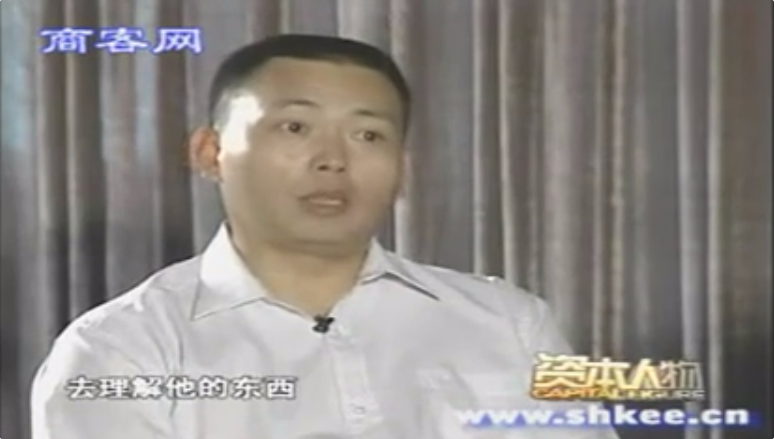

# 2006-资本人物-专访[[段永平]]

  

（声明：转录文稿未经逐字人工校对，仅供参考，文本中可能存在错误、遗漏或不准确之处，一切内容请以原视频为准。）

**00:36** 【旁白】 资本人物之——段永平。  

**00:39** 【旁白】 段永平，1961年生，江西人。1988年来到中山怡华公司，1995年创办[[步步高]]。2001年移居美国，2001年开始投资美国股市。2006年位列《新财富》500富人榜第145位。  

**00:58** 【旁白】 美国西岸时间2006年6月30日上午11时左右，一场竞拍正紧张地进行着。这次竞拍是为了赢取和股神沃伦·[[巴菲特]]共进午餐的机会。这种竞拍从2003年开始，已经连续举行了四次，巴菲特把这些竞拍的款项都捐献给了慈善事业。在经过数次不断出价后，当网名叫 fastisslow 的人报出了62.01万美元的时候，竞拍终于结束了。  

**01:29** 【旁白】 7月1日有人发现，fastisslow 正是步步高公司的创始人段永平。  

**01:36** 【主持人】 最近网上有一则非常引人注目的消息，说一个网名叫 fastisslow 的人以62.01万美金的价格竞拍取得了与巴菲特共进午餐的这样一个机会。那您跟我们说说这人为什么取名叫 fastisslow 啊？  

**01:57** 【段永平】 其实这个名字意思就是“欲速不达”。其实做事情呢，我的一个最基本的哲学，就是说不求快，求安全。这次被大家知道也是因为，我在eBay上注册的时候其实没有想那么多，就直接用了自己的ID。结果很多人就知道这个ID是我的，本来就很多人知道，所以才会被大家知道，否则这个事可能也不会有谁知道这件事。  

**02:24** 【主持人】 那您为什么想到要参加这个竞拍，然后跟巴菲特共进这个午餐呢？  

**02:30** 【段永平】 两个方面原因吧。一个就是说，我这个也是很久以来……因为我做投资有个很大的因素是跟巴菲特有很大的关系。那么就是无意中看了他的有关他的东西以后，我发现他说的这个投资理论我看懂，因为我做了这么多年企业。所以我觉得沃伦·巴菲特其实，如果我没有看过他的东西，我大概不一定敢去做投资。那么因为看了他的东西，加上后来我又比较认真地去理解他的东西，我发现这个对我的帮助非常大。我投资这几年，的确收获也很大，所以我想，如果能够有机会跟他聊一聊啊，那么我可能会有更多的启发。因为我还有很多一些细节的问题，还是挺想再问一问他。  

**03:25** 【段永平】 就是说你手里有多余的钱，但是没有好的目标；和当你手里钱不够，却找到了好的目标的时候，你怎么办？  

**03:33** 【主持人】 这是你最想问的问题吗？  

**03:35** 【段永平】 谈不上了，我没有特别多想问的问题。就是说人家非要问我想问什么，我想这个问题我大概会问。因为我有一个朋友很喜欢借钱，有一个做投资做得非常大的朋友老在借钱，我其实是想帮他问这样一个问题。  

**03:51** 【段永平】 另外一个很重要的原因就是，我本身也是……因为我自己的，说实话这些年也赚了很多钱，那么我太太和我就说，都是觉得钱这个东西你自己够花就行了。所以其实把相当一部分都捐到一个慈善基金会里头去了。那么正好这是一个机会。  

**04:13** 【主持人】 这个数目的确定，是因为你觉得这顿饭就值这个价钱，还是说像你刚才说的基金会每年要花掉的这笔钱数是有定量的？  

**04:22** 【段永平】 这顿饭我认为是无价的。就是说其实我觉得多少钱都不为过。但是凡事都有一个度吧，我自己就很随意的就设了这么一个价钱。这个反正是在我们基金会的预算之内。  

**04:39** 【主持人】 在网上有很多网友提出一些质疑，说为什么您的这个基金会善款要捐给国外，不捐给国内的一些可能更需要钱的地方？  

**04:50** 【段永平】 第一，美国对我来讲也不叫国外，对吧。第二，我在国内捐的钱其实也不是就没有，我们以前每年也都捐，我们只是不太吭声就是了。最早我们开始捐钱，华东水灾的时候我们就捐了，我印象非常深刻。捐完了以后，就从此没有人告诉过我们这钱去哪儿了。那我觉得，说明这个慈善募捐的环境还是不太好了。那我们在斯坦福大学就建了一个基金会，就专门资助中国区的学生。就是说你捐钱不一定非要捐到中国来，但是它可以跟中国有关系。  

**05:28** 【主持人】 那它现在有没有什么赚钱的途径？  

**05:31** 【段永平】 投资。因为我本身我管的这个，除了管它花钱以外，还要管它的投资。我的回报还不错，我的基金会其实从捐出去到现在都有有一倍多的成长了。  

**05:43** 【旁白】 2001年，段永平妻子一起移居美国。从那时起，他的投资生涯才真正揭幕。段永平坦言，过去五年他在美国炒股赚到的钱，比此前他在国内做十多年企业赚的钱还要多得多。  

**06:01** 【主持人】 在您赚过的钱里面，有百分之多少是在美国投资股票的时候赚的呢？这个比例大概有多少？  

**06:09** 【段永平】 从我现在个人财富来讲，我想九成多以上都是吧。  

**06:14** 【主持人】 那大家现在也说，估计您有15亿的身价，有人这样估过。说大部分的钱都是您在美国投资股票赚来的，是这样的吗？  

**06:27** 【段永平】 有多少钱这个我不好讲了，我觉得15亿也不算是很多，但确实主要是股票赚的。  

**06:37** 【主持人】 那您是一个投资成功率非常高的人啊？  

**06:41** 【段永平】 至少可以说我运气还不错。就是一个投资者来讲，我想我应该算是比较成功的。因为我做投资时间非常短，其实满打满算还不到五年。  

**06:52** 【主持人】 从2001年去美国才开始吗？  

**06:54** 【段永平】 我是决定去美国才开始的。  

**06:56** 【主持人】 之前在国内没有投资过股票？  

**06:58** 【段永平】 没有，从来没碰过。  

**07:01** 【主持人】 那到美国以后，您是说看了一些巴菲特的书之后，有这样一个想法想投资股票的？  

**07:09** 【段永平】 对。  

**07:11** 【旁白】 段永平在去美国之前从来没有投资过股票，而之后却成为高手。他是如何理解巴菲特的投资真经的呢？  

**07:20** 【段永平】 沃伦·巴菲特讲就是说，你买一只股票的时候，其实就是相当于你在买这个企业，或者买它企业的一部分。那么这个企业的所谓的价值，其实就是它折现的价值。就是你把这个企业，它的整个生命算下来它总共能够值多少钱，你把它折现到今天，考虑利息、[[复利]]。  

如果你现在买的价格是低过它的价值的，你就可以买。其实这个挺简单的。但是你要去找到它的价值是一件非常困难的事情。所以简单的东西不等于容易。很多人就会有一个误解，说你是说它容易，我说我不，我告诉你这个东西非常难，但是它很简单，就这么一点点事情，你要搞懂它。大部分人在做投资的时候，并不试图去了解企业，而看图看线，容易受价格的影响。  

我觉得在这个地方，沃伦·巴菲特给我的启示是非常大的。早期我也是一样，因为人都是凡人，很容易受到外在的东西影响。那看了他的东西以后，我觉得有时候你就必须要坚持。  

**08:49** 【字幕】 资本人物之：段永平。  

**09:36** 【旁白】 怀揣着“投资圣经”和发财的梦想，段永平于2001年底开始买入[[网易]]的股票。当时NASDAQ崩盘，中国网络概念股跌得惨不忍睹，搜狐、新浪、网易等股票价格一度在一美元附近徘徊，面临被摘牌的风险。  

**10:12** 【主持人】 那你当时一共拿了多少股这个股票？  

**10:16** 【段永平】 我记得是两百多万股吧。  

**10:19** 【主持人】 也蛮多的啊。  

**10:21** 【段永平】 还可以了。两百万股出点头，超过5%了，刚刚过5%。不对，我最多是到了6%好像，6%点几。  

**10:30** 【主持人】 这是你赚得最多的一只股票吗？  

**10:33** 【段永平】 我不想说。但是的确是挺多的一只。我觉得这一只股票给我带来的回报大概就……可能差不多有一个亿美金。  

**10:46** 【主持人】 你当时足够了解它吗？  

**10:48** 【段永平】 我觉得一直都在慢慢地了解。那么随着它价格的变化，其实我对它了解也越来越多。我还是觉得这家公司还是非常不错的一家公司，跟我们做企业的这种心态也比较像了，就是相对来讲比较[[本分]]。不是追求这种快速扩张啊，那么搞一些很……我说不清楚，就是些乱七八糟的事吧。所以你拿着它的股票，就算价格有点波动，你心里还是比较踏实的。  

**11:26** 【主持人】 如果要是当时跌了怎么办呢？这笔钱？  

**11:29** 【段永平】 跌了就想办法再借点钱再买啊。当时最遗憾它不跌下来。因为网易买，我这个决策比较容易决定。它有两块多钱的现金在手里，企业也还是处于非常不错的雏形状态，就当时它没有完全发展起来。但是以我做企业的经验，我觉得这个公司绝对不可能继续一直亏钱下去、永远赚不到钱。两块多钱的现金在手里头，才卖不到一块钱，这个本身就是已经很有意思的事了。  

**12:02** 【主持人】 也是比较有信心的对它的这个增长？  

**12:06** 【段永平】 我当时就觉得这个公司被严重低估了。但是什么时候会回来其实我是没有想过的。因为这个东西不是你能够预计的东西。就是投资有个最大的特点就是你不能给自己定目标，说我今年一定要赚百分之多少。因为价格是市场给的，但是价值是它内在的东西，所以你最重要的是了解它的价值，然后你去等待市场最后给它一个公平的价格。那么一般来讲的话呢，时间其实也不会很长。我个人的经验大概也就三年吧，最多了。为什么说三年？是因为我没有见过超过三年的。当然是因为我时间短，我总共投资就没几年。所以你只要有个两三年的耐心，你怎么着其实，你要找到好公司，你拿在手里怎么着都是能赚钱的。但倒过来讲，你要拿错了股票，你拿的时间越久可能就越糟。  

**13:03** 【主持人】 当时这一类的股票肯定不单这一只，它跟其他的这一些同类的公司相比，最大的优势在哪儿你觉得？  

**13:13** 【段永平】 那是因为我能看懂。别的公司可能好，但我看不懂，我就不能投。就像有些人问为什么沃伦·巴菲特不投微软，是不是他的错误？我觉得这个不是他的错误。他搞得懂可口可乐，搞不懂微软，所以他投了可口可乐，他同样是赚到钱了，对吧。所以我在投网易的同时，别人可能投了别的公司也赚到钱了，我也不嫉妒，他跟我也没关系，因为我也没搞懂，或者也没有花精力去搞。网易我是觉得，我比较看得懂，尤其它的生意，它的这个产品，是我最熟悉的一块。因为我做游戏起家的嘛，做小霸王游戏机我相信现在还有很多人还知道。  

**13:57** 【主持人】 您是比较喜欢[[集中投资]]还是会分散投资呢？  

**14:02** 【段永平】 我很集中。我是非常的集中。我当初买网易的时候，其实……其实就花了一百多万美金。我当时只有那么多闲钱，后来还借了一点钱，总共大概两百万美金，这还包括一些融资等等在里头。  

**14:22** 【旁白】 网易的股价表现没有让段永平失望。由于有了数量庞大的网民基础，2001年中国移动的移动梦网推出之后，短信很快成为网易的盈利业务。后来网络游戏开始异军突起，成为网易最主要的利润来源。网易公司由此获得了很好的收益。二级市场上，网易股价一飞冲天，一度逼近100美元大关。段永平凭借此次投资，身价暴增。  

**14:52** 【主持人】 那能不能跟我们说说，您选股票有什么样的一个原则，或者有什么样的一个角度吗？  

**15:00** 【段永平】 最重要的还是你要去了解它的这个企业。因为我觉得我做企业出身的，我对企业的了解比较深刻一些。就不是太……我不相信神话，也不听他们的所谓的 story，就是他们讲故事啊或者什么概念这些东西我都不是说特别的在意。最重要是这个企业它到底能够……就是你要去根据你看到的情况，你要去想象它的未来会是什么样子。或者呢，也有一些，就投资有一些很特别的情况，就是说它现在的价值就已经远远超过它的价格了，这个时候就是一个买的机会。这其实就是沃伦·巴菲特讲的东西。你看我大概比方说，八九毛、一块钱买的这只股票，你能够留到……八九十块钱你都没有卖，那这个过程当中其实你每天都可能是想要卖的。  

**15:54** 【主持人】 都在斗争？  

**15:56** 【段永平】 不。如果你了解这个企业，你认为它有这个价值，你可能就不着急卖。否则你每天就会受价格的影响，因为价格它天天可能今天一百了，明天八十了，后天到七十了。  

**16:06** 【主持人】 现在持有的这些股票，就后来你进行的这些投资，也都是跟你熟悉的这些领域相关的吗？  

**16:13** 【段永平】 不一定天生就熟，但是前提是我在投资或者在持有重仓的时候，我已经很熟悉了。你可以学习的，对吧，你可以了解它。所以我投资的东西有一个最大的特点，都是跟我们的生活息息相关的东西。你让我投一个，说八竿子打不着、完全没有感觉的东西，我不太敢投。因为完全没有认识，你比方你现在让我去投一个说不清楚啊……你比方说高分子化工的一个什么产品，我对这个产品完全没有概念。可能非常好，也可能不好，我就没有办法去投。  

**16:59** 【主持人】 那你怎么对待这些比如说拿在手里不太……情况不太妙或者已经亏掉的这些股票怎么处理啊？  

**17:08** 【段永平】 每只股票不一样。就如果你是从像我说的这种就投资一个企业的角度来讲，如果是真的是好企业，如果它的价格低下来，如果你还有钱，你可以多买。如果没有，你就束之高阁，把它搁在一边就不要管它了。但是倒过来讲，如果你发现这个企业其实是一个不好的企业，它远远呢……就是它目前的价格虽然它掉了很多，它依然是偏高的价格，就是远高过它的价值，你就应该卖。跟你亏了多少钱是没有关系的。因为你要不卖呢，你还会继续掉。所以最重要的就是你要真的了解这个企业。  

**17:48** 【主持人】 那您看您是不给自己定目标，但是我发现您是给自己有定了一个规则在的，就是不该碰的绝对不碰。  

**17:55** 【段永平】 对，规则很严格。  

**17:57** 【主持人】 该握在手里的一定不放手。  

**17:58** 【段永平】 是的。  

**18:00** 【主持人】 您觉得这种规则是在任何一个国家的股票市场上都能……都能够被很好地验证，并且遵循它一定都能有很好的投资回报的吗？  

**18:11** 【段永平】 我认为是在任何经济行为里头都是一样的，包括股票市场。它没有差异。这个也是我看了巴菲特的东西以后，我得出来的最大的体会。你搞懂了那你就会赚钱。  

**18:25** 【主持人】 您现在在国内的这个A股市场也有一些投资？  

**18:28** 【段永平】 我有一只股票。  

**20:00** 【旁白】 1988年，他南下创业，来到了一家濒临破产的小厂，并且一手打造了后来赫赫有名的学习机品牌——小霸王。  

**20:14** 【蒋昌建/主持人】 很多人在看到现在这则消息的时候，看到你的名字说“段永平”，并不是每个人都知道这个人是谁。但是说到“步步高”，可能大家就开始有恍然大悟的这种感觉。也很想知道你创业初期的一些事情，当时是怎么到中山怡华的？  

**20:36** 【段永平】 我其实毕业以后呢，我是在佛山找的工作。后来呢，对当时工作不是很满意。加上呢，自己当时觉得玩游戏这个东西有点意思，后来发现中山这家公司呢，在做游戏。正好我有个同学在里头，也是一个同学告诉我，说我们这公司做游戏，我说这个东西会有前途。这有些东西都是冥冥中的东西。我投资网易其实就跟我当年做游戏有很大的关系，因为我了解游戏这个市场。绝大多数人其实对游戏的理解不可能像我这么深。  

**21:11** 【主持人】 这个中间一年的时间非常短，这种转变是非常简单的吗？  

**21:18** 【段永平】 简单，但很难。那么小的企业，几千块钱人民币起的家，就是一个小生意吧。只是说你耐心地、坚持地做下来，慢慢就起来了。  

**21:28** 【主持人】 你在的时候，就是推广这个市场的时候，你有没有想过什么独特的办法？  

**21:34** 【段永平】 其实没有特别独特的办法。因为做企业、做投资这些东西其实都很简单。就是说呢，你首先你找到市场的需求，找到消费者的需求，然后你想办法去满足它。那么首先你对产品有感觉，我自己就比较喜欢玩游戏。到现在我儿子最佩服我的就是说：“你看，你爸爸很忙啊回来，好多人找他。”他说：“对呀，我爸爸很厉害，我爸爸很会玩游戏，可以玩到二十级甚至更多。”就是在他眼里，因为他还小，他觉得我玩游戏玩得很好。  

**22:11** 【段永平】 那么我当初也是因为发现有这样一件产品，所以我对这个产品市场一直都比较有信心，知道很多人会喜欢玩这个。  

**22:19** 【主持人】 你有没有亲自去这个……找客户啊，或者说就是打开这市场？  

**22:25** 【段永平】 我们就几个人，我不亲自去谁去？大家都是亲自去的。  

**22:30** 【主持人】 那时候怎么做的呀？你有没有印象？  

**22:33** 【段永平】 那很辛苦啊，确实很辛苦。有时候一天工作十好几个小时。正因为我一开始那么辛苦，我后来就想到你必须要形成一个系统。然后呢，所以我们才形成了有代理制啊，有自己整个管理体系啊、价格体系啊。一直到后来我可以自己不在一线，我去做任何事情都是这样。最重要的是首先你要[[做对的事情]]，然后[[把事情做对]]。  

**22:58** 【主持人】 这个数据很吓人，是十亿的年产值，最后做到？  

**23:03** 【段永平】 呃，对。到我离开的时候，应该是差不多有这个数了。  

**23:10** 【旁白】 段永平将小霸王从昔日负债累累，做到产值逾10亿的知名企业。但他依然是一个高级打工仔，被称为当时的“打工皇帝”。段永平并不甘心，段永平提出改制，但怡华集团高层拒绝了这个要求。  

**23:28** 【段永平】 做一个企业，你发展到一定程度，你的企业员工的奖励机制、股东的这种回报机制，都必须要有很明确、很清晰。那在我们这个公司里头，所有的制度都没有特别清晰过，那么都还是有一点作坊式的这种做法。那么在这种情况下呢，从我这种管理的角度来说，我是很难想清楚，比方说五年以后啊、十年以后啊，我们的员工如果做得好他会得到什么样的回报？如果你没有一个很明确的交代的话，我觉得你企业长期经营下去，一定会在将来碰到很大的困难。  

**24:07** 【旁白】 1995年7月，段永平提出辞职，并在两个月之后成立了步步高公司。  

**24:13** 【主持人】 当时创建步步高的时候，是之前就想好就是要做这个行业吗？  

**24:19** 【段永平】 没有。当时呢，离开的时候其实什么也没想。想着要离开，那么我是想我就去美国吧，我想追求就是我现在太太了，我那时候就其实就有这种想法。因为那时候还连女朋友都不是呢。但是呢，因为当时我们公司招进来很多人啊，还有很多人其实他是冲着我来的。那么离开之后呢，大家有一种很大的失落感。我自己觉得自己有，反正觉得自己有点问题、有责任吧，所以觉得那做就做了。所以当时并没有想好要做什么，因为我当时离开的时候有一个承诺，我说我一年之内我不做同行。  

**25:03** 【段永平】 但是后来呢，出了一些变故。就是说，我离开以后呢，接任我的这个（小霸王）人呢，就觉得以前这些人都是“阿段”的人。所以呢，就不用他们了。所以很多人就再回来找我，说：“我们怎么办？我们也过来吧？”那么这一下就难倒我了。因为你过来呢，我们原来做这个产品我们又不能做，然后来的人又很多，那大家说要来呢，我还觉得得自己真的有这种责任。所以原来很多人就帮我回来找我，所以我就选去做了外销。主要是让这些人忙起来。  

**25:40** 【主持人】 那时候外销是很容易吗？  

**25:43** 【段永平】 我还觉得那个自己真的有这种责任，所以我也没有什么事情是容易的。其实我们第一年还亏很多钱。但是亏钱我觉得倒无所谓，因为最重要是赢得时间吧。而且呢，我觉得这也是冥冥中的东西。我们现在俄罗斯的外销做得非常好，就跟我们那个时候有很大的关系。因为我们光销俄罗斯就依然有一个多亿吧，不到两个亿美金的营业额每年。我不知道国内还有哪家做电子行业的公司能够有这么大的销售额。  

**26:11** 【旁白】 从1997年开始，步步高公司开始在央视打广告，并且在两年之后成为央视的标王。对于这个称号，段永平淡然处之。  

**26:21** 【主持人】 很多人了解、就是听闻“步步高”这个品牌，都是从央视的广告当中。什么时候开始觉得这个产品一定要做广告，而且要去央视做的？  

**26:33** 【段永平】 那个时候做央视我觉得，我们基本上是竭尽全力在做，因为我一直认为那个是最便宜的。  

**26:40** 【主持人】 有很多人说段永平会做广告，所以小霸王和步步高产品才有这么高的知名度。你觉得这种说法对吗？  

**26:49** 【段永平】 我记得我读EMBA时候，一个诺基亚的同学也这么跟我说。他说：“对呀，我们就像诺基亚一样，只会做广告。”他说：“我们诺基亚可不是只会做广告。”我说：“那你凭什么说我们只会做广告？”我也这么说。一个企业啊，其实呢，如果说它只会做一样东西，它一定是会死的。没有哪个企业是靠广告起来的，就是说能够靠广告生存下去。  

**27:13** 【主持人】 那现在作为一个企业家的身份，评价一下广告对于一个企业的这种影响？  

**27:20** 【段永平】 企业做起来就像一个木桶一样，它是一个就是哪块少你得补哪块，你不能够有明显的缺陷。所以如果广告是你的短板，你就得补上。如果你企业别的都挺好，就知名度不够，那你要补上。但是如果说你光靠广告，你是肯定死的是最快的。  

我记得以前有一个酒，它打广告打得非常大，还做什么标王啊。然后我说：“哇，他们真的敢花。”我说老板想得开。后来我就问那些喝酒的朋友，我说：“唉，这酒好喝吗？”就在现场，投标现场啊，投完了，他们说那酒难喝死了，我不爱喝。  

我说：“这下它就死定了。”这就是一个简单的原因。就是你不好的产品，你敢这样打广告，你这是自己找倒霉呢。  

**28:12** 【主持人】 那您现在在步步高占有多少的股份呢？  

**28:15** 【段永平】 我占了很少。就是相当于一个顾问。  

**28:21** 【旁白】 几年下来，段永平逐渐稀释了他在步步高的股份，退出了管理层。如今段永平定居美国，专门从事投资、慈善事业。剩下的大部分时间留在家里陪小孩。他每年都会回几趟中国，他把这当做来中国出差。  

**28:39** 【主持人】 有没有什么遗憾这么多年来？  

**28:42** 【段永平】 没关系。你比方说举个很简单的例子，你买一支股票，对不对？本来计划买两百万股，结果只买到了二十万股，价格就上去了。本来你应该继续买，你没买，结果就少赚了很多很多钱。那你觉得这是遗憾吗？当然是遗憾。你说有重要吗？它不重要。或者你买了一只股票，结果买错了，亏了很多钱。说我要不买，我这几百万就不用亏了。那么这遗憾吗？遗憾。那人总会犯错，永远不可能避免这种遗憾。  

所以也就没有必要去耿耿于怀。那生活当中很多事情其实都一样，你说什么事情你都很顺利，其实你就活得没劲，对吧？所以有一些波折啊，有一些不顺利啊，有一些遗憾啊，那生活当中的一部分。其实你说的什么事情，其实你就活得没劲，对吧？有一点不顺利，也是一个记忆。往往这是让你记住生活中间很重要的一个环节，这就是一个记忆。  