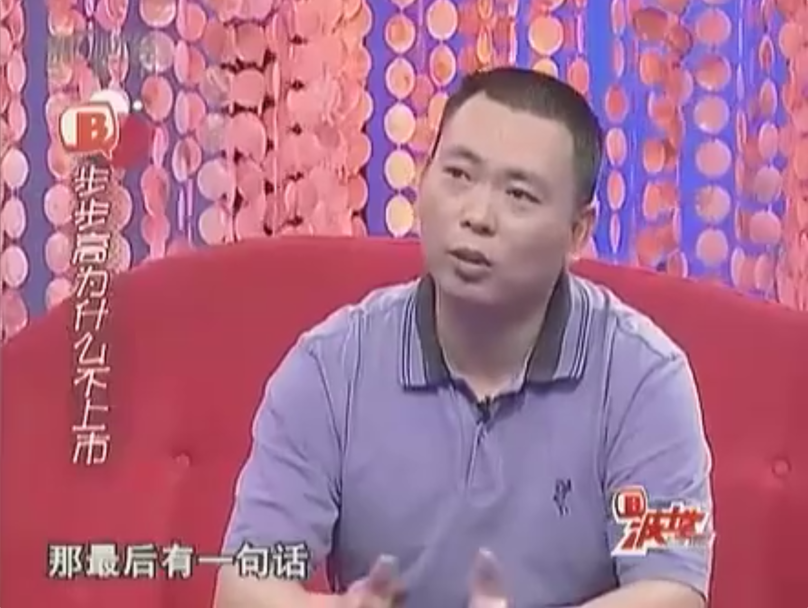

# 2007-波士堂专访[[段永平]]，谈价值投资，上市，企业

  

（声明：转录文稿未经逐字人工校对，仅供参考，文本中可能存在错误、遗漏或不准确之处，一切内容请以原视频为准。）

**00:05** 【曹启泰】  
他们分别是来自浙江大学以及交通大学的同学们、朋友们，欢迎大家。  

**00:10** 【曹启泰】  
三位观察员分别是：杉杉投资控股有限公司执行总裁、中科廊坊科技谷董事长 胡海平先生。  

**00:23** 【曹启泰】  
紧接着我们要介绍的这位，也是以好友身份，也是以观察员身份来到节目当中，二十一世纪经济报道创始人、总编 刘洲伟先生，欢迎。  

**00:36** 【曹启泰】  
第三位要为各位隆重介绍的这位呢，东方卫视对外事务总监、著名节目主持人、智慧型的才女，站在舞台上就是风采，让我们来欢迎袁鸣小姐。  

**00:52** 【曹启泰】  
大家好，谢谢。为大家介绍一下今天的BOSS，创造了两个著名品牌：小霸王和[[步步高]]。之后他定居在美国，因为在大约其实是8毛，应该是8毛吧，接近1美元的价格左右，大量吸纳了[[网易]]的股票，就净赚了1亿美金，因此被人称为股神。我们要为大家隆重介绍这位BOSS，步步高电子工业有限公司董事长 段永平先生，请看大屏幕。  

**01:21** 【旁白】  
段永平，广东步步高电子工业有限公司董事长、投资人。1982年毕业于浙江大学无线电系。1986年就读于中国人民大学经济系计量经济学专业研究生。1989年任怡华集团电子游戏机厂厂长。1991年出任小霸王电子工业公司总经理。1995年离开小霸王，创立步步高电子工业有限公司，任总经理。1999年以其明晰的远见和创造能力，被《亚洲周刊》评为亚洲二十位商业与金融界“千禧年行业领袖”之一。2002年底，段永平全家来到美国并定居北加州，主要在美国从事投资业。2005年，段永平与其妻子成立了家庭慈善基金 Enlight Foundation。  

**02:06** 【曹启泰】  
刚刚这一段介绍里面有几个画面，我相信大家印象会比较深刻，你看到了几位名人，各位对他有什么印象？  

**02:13** 【刘洲伟】  
我觉得他是一个能够不断创造奇迹的人，而且经常是从平淡中创造奇迹。  

**02:22** 【曹启泰】  
胡海平先生，您会预备从什么样的一个角度来发问？  

**02:26** 【胡海平】  
应该说他是我的师兄啊，也是浙江大学的骄傲。他这一路过来呢，应该都还是比较有独到眼光。那么现在从一个实业家转向资本投资人，所以我想问问他在美国现在的情况，那么对中国的股市啊，他预测一下。  

**02:45** 【曹启泰】  
哎，这个问题好像在帮袁鸣量身打造。  

**02:49** 【袁鸣】  
对，其实我真的也很关心的。他不是刚跟[[巴菲特]]吃过一顿饭吗？这顿饭到底说了点什么呀，我挺关心的。我还很奇怪，你说他做小霸王用成龙做广告，做步步高用李连杰、施瓦辛格，可见段总一定是一个这种英雄气概、霸王气概。但是为什么在2001年突然就退出江湖了？有什么难言之隐？  

**03:17** 【曹启泰】  
他不玩了。好，我们都来把他问清楚。各位，这个解铃还需系铃人，只有请他自己才能把所有的答案呈现在你面前。让我们掌声有请步步高电子工业有限公司董事长 段永平先生。  

**03:32** 【曹启泰】  
您好，欢迎段总。  

**03:42** 【段永平】  
大家好，我叫段永平。  

**03:51** 【曹启泰】  
感觉特别谦和。这样一个个性是，是一开始就这样，还是今天您是经过常年累月的修为，到了今天变成现在的一个气度？  

**04:02** 【段永平】  
我也说不清楚。我见巴菲特的时候我觉得他的个性比较谦虚。  

**04:09** 【袁鸣】  
我还是不知道他跟巴菲特说了些什么。  

**04:12** 【曹启泰】  
你想知道内容？  

**04:13** 【袁鸣】  
对呀，他不是号称有问题，就是手里有钱不知道该投哪儿，这怎么办？或者说有了好项目没钱的时候，又怎么办？有答案吗？  

**04:23** 【段永平】  
这个问题其实我最后就没问。因为呢，他说别的事我就觉得我其实没必要问了。所以……  

**04:30** 【袁鸣】  
他说了些什么别的事？  

**04:32** 【段永平】  
就是你比方说，他说我只希望富一次。就是说你不应该去冒不该冒的风险。不要借钱去博富。他说我只希望富一次这句话其实就很简单了，你如果借钱了，你可能富了，然后转机又穷回去了，那么再富第二次、第三次是你美好的愿望，你不一定做得到。所以你何苦要这样呢？对吧，我们做企业本身也是这样，就是你要安全地去经营。对吧，求快是不对的，当然太慢也不对，所以你是要有一个合理的、你能够掌握的速度，是一个安全的概念。  

**05:03** 【曹启泰】  
来问一下，胡先生你的体会，你说了一个叫fast is slow（快即是慢）。  

**05:08** 【胡海平】  
太快了就不一定是好事，对吧。那现在股民拼命地把钱往股市里头，不怕高，速度也很快，开户也很快，你有什么忠告和建议？  

**05:17** 【段永平】  
那第一我不想扫大家的兴，对吧。那么，当然我还是会说实话，我觉得如果大家是玩一把无妨，但是赌身家千万不可。我也不能说这股市高了低了，我要说它高了大家都不高兴，虽然我确实是这么认为的。  

**05:39** 【曹启泰】  
他听懂了。好，我来问一下，刚刚说他，其实刚刚我们胡先生用的那句话，听说也是你的一个网名，是不是？Fast is slow，这是你的网名吗？你要不要解释一下你的用意是什么？  

**05:51** 【段永平】  
用意就是欲速不达。对，我做企业，我觉得一直都是这种观点。我觉得你要，因为你不是想做一天、做两天，图一个一时痛快，你是想长久的经营，是所谓的有序经营。所以就有挺像你开车一样，你说我开车我要到达一个目的地，那我就是能开多快开多快，那我车能够开200公里、300公里的时速我都开。  

**06:17** 【曹启泰】  
通常到不了。  

**06:18** 【段永平】  
这就很危险。对，你说得很对。那么我跟很多人讲，我说我这么多年开车，对吧，经常在路边见到熟人。有些人可能修好车还能再见，有些人可能就不见，就不见了。我说这个其实是一个比喻，而且你像我们这个是属于长跑，所以短期的、短期的告诉并没有意义。你长跑用短跑的速度，那你一定是跑不完的。  

**06:41** 【曹启泰】  
您刚提到了跑步，袁鸣刚刚提了一个问题，怎么跑着跑着，你感觉离开跑道了？你刚刚说有了朋友路边停啊，有的修一修就上路，可是您根本就离开跑道，那个2001年、2002年那什么？  

**06:55** 【袁鸣】  
您就突然离开您的企业去了美国。  

**06:58** 【段永平】  
我去美国主要也是因为家里的缘故。对，因为我太太，就我们结婚之前，她其实本来就在美国，为爱定居美国。那你想要跟人家结婚，我就自己承诺说，说我们要结婚，我将来我就搬到美国来住。说到了就做到。结果呢，人家就说我帮你申请个绿卡，我就说好吧。因为我觉得这个，申请这个东西都很长很复杂，很多很多年的，应该很复杂。因为我们之前是，对，我们结婚以后我们是搬回来住了，但是就没想到绿卡很快就批下来了。  

**07:35** 【段永平】  
那么这个确实也很意外，我自己也措手不及，其实开始没有准备。当然也没有马上走，后来因为小孩这个也慢慢大了，也想到希望小孩在那边受教育，因为我觉得我们共同的观点，觉得自己可能更喜欢那个教育体系。就在2002年年底的时候决定搬过去。  

**07:54** 【曹启泰】  
这一讲也同将近五年时间了，有一个七岁的女儿……  

**07:58** 【段永平】  
不，八岁的儿子，五岁的女儿。  

**08:01** 【曹启泰】  
特别谈谈你的家，你刚刚提到了太太其实学的是摄影。对。您现在花多少时间在家庭生活？我现在感觉我们在谈的好像不是一个呼风唤雨的企业家。  

**08:13** 【段永平】  
我大概一年会回国两三次吧，那么每次待十天左右。那么剩下的时间就会在家里了。  

**08:24** 【曹启泰】  
三位你看到了什么？胡先生。  

**08:26** 【胡海平】  
应该说他是一个非常负责任、心态也比较平，几句话最终在说的还是比较顾家。但是我总的一个感觉，你在国外赚了很多钱，是买卖股票，但实际上大家很希望看到你把自己的股票能够卖出去。这就意思就是步步高，假如在现在目前这样形势下，实际上是一个非常好的机会。几年前如果策划上市的话，应该说，我们认为至少它的市值是上百亿的。上百亿，对吧？那我就想请教一下师兄，对吧，你在这一方面，前几年是打算了还是没打算？那么最近现在有什么打算？或者是有没有后悔过？  

**09:04** 【段永平】  
很有意思，我这次其实跟巴菲特聊到这个问题，因为他问我公司的情况啊。那最后有一句话，我说我们公司反正一直以来都不决定、就决定不上市，或者叫不决定上市了，反正这个都一样。那么巴菲特没有正面说什么，他跟我说了一个例子，他说他认识一个人，我不想说是谁，但是你们肯定都知道，说宁愿放弃他一般的身家，让公司回到私有状态。他就是从侧面认为你这样做其实是对的。  

**09:39** 【段永平】  
但是你做企业是很无趣、很脏的，就是说你可能很累很脏、很郁闷的事情，有很多重复的东西。那我是不愿意用上市这种压力来改变这个公司的轨道。因为上市有时候，它会导致有些公司会出现一些短视的行为。那么上市当然它又会帮助很多公司，就是比方说你确实需要这些资金，你如果有一个很好的主意，你根本就没有钱的话，你不上市你根本就没有机会。所以我觉得跟每一个人的实际的情况是有很大的关系。我觉得像我们这样就挺好。  

**10:17** 【曹启泰】  
我今天发现一件事情，段先生是所有来到波士堂的老板里面，从头到尾，从刚刚节目一开始到现在，他一直提到“我的企业”或“我的公司”，但到目前为止他从来没有讲过一次名字，你们有没有发现？  

**10:31** 【段永平】  
我做节目稍微忌讳这个，就是说，因为这是你的节目，我总提我的名字呢，有一点占你便宜的意思。  

**10:39** 【曹启泰】  
不不不，别客气。无所谓，节目是大家的。如果，如果你一直不提你的企业的名字，你哪怕提提我的名字，对不对？好了，开玩笑。我问一下我们的刘先生，你想问什么？  

**10:52** 【刘洲伟】  
这么多听他提到过两个人，当然除了他太太了。一个是松下幸之助，一个是巴菲特。就是现在感觉这轨迹是从松下幸之助到了巴菲特，那么这中间是怎么转换的？除了您刚才讲的家庭这个原因以外。  

**11:16** 【曹启泰】  
而且家庭的原因也不觉得应该会从松下幸之助转到巴菲特，好像跟家庭无关。  

**11:22** 【段永平】  
有一点点关系，是因为我们决定搬到美国去，我就想我得找点事做。后来我就翻了很多书，最后后来无意中看了巴菲特的东西，我说这个东西我懂。看他的东西就是跟做企业是一样的。所以在我的眼里，松下幸之助和巴菲特并没有本质的差异。他就是，一个自己做，一个是去看别人如何做，对吧？就像说你要把你的东西，就是像自来水一样，那么方便地提供给你的消费者。但是还要保证品质，保证方便度，有很多，包括我去过他们的总部，见过他前任的CEO，现在的董事长。也看过他那个里头有一个，松下有一个叫做“素直”两个字，那我猜呢，跟我们公司的“[[本分]]”的意思差不多。回到事物的本源，你说到底你在干什么？那么有很多就是说，对消费者的态度、对产品的这种想法，我觉得……  

**12:26** 【曹启泰】  
是可以共鸣的。  

**12:27** 【段永平】  
对。  

**12:28** 【袁鸣】  
我听段先生的故事，我觉得特别好玩。因为他从一个企业家突然转行成了一个投资人，中间好像没有什么太大的关联，后来我就在拼命地说服自己，因为他姓段，所以他的人生就是一段、一段、一段、一段……  

**12:43** 【曹启泰】  
哪有这么说法的呀。  

**12:45** 【袁鸣】  
真的，你刚说到你有一个stop doing list（[[不为清单]]），你有没有不做的东西，你告诉我有哪些是你肯定不做的？无论是在你的公司里还是在你的私人生活当中，你肯定不做的是什么？  

**12:55** 【段永平】  
像李宗盛讲的这个，“道义放两旁，利字摆中间”，不是有首歌是这样唱的吗，好比对不对？开个玩笑，我说我[[不借钱]]给朋友，这是我的一条。那么，我不投资某一类型的公司。比方说我不懂的东西我不碰。所以你要跟我说这些东西我不懂，我说第一我除非能够弄懂它，第二我就不会碰它。然后很多人就说了，这个机会可能会失去啊，对吧，你弄懂了它可能已经涨上去了。我说又如何？一辈子你有非常多的机会，但是呢你要抓快，你可能就掉进去了。这就是快是慢的一个概念。所以我投资我觉得最重要的是你不要亏钱，而不是说你要去赚到一个这样的机会或者那样的机会。机会永远都在，就是你抓住机会的能力是有限的。所以每个人抓住机会的能力不一样，所以最重要要是你要知道自己什么事情能做，什么事情不能做。尤其是不能做这个东西特别重要。  

**13:51** 【段永平】  
巴菲特其实也是这样，很多人说巴菲特为什么没有买谷歌？巴菲特为什么没有买微软？那么对他来讲呢，他不懂微软这个生意，他也没有搞懂，所以他就没碰，没什么错，包括像谷歌，我记得我那年去参加他那个股东大会，他一口一个谷歌、一口一个谷歌，最后呢还是没有买，为什么呢？他觉得贵了。那么我觉得这个其实也没有错，因为在他的眼里他不太了解这个行业。但是我知道即便他这个年龄，他其实一直都在很努力地想去弄明白，包括你看他最后用了比尔·盖茨做他的董事会的成员，对吧。我想这个也是有一定的关系了。包括他跟谷歌的两个founder，跟谷歌的两个创始人非常熟悉，他对谷歌其实挺了解，远远超出我的想象。  

**14:38** 【段永平】  
人是很容易犯错误的。因为巴菲特也讲了，你可能九十九件事情做对了，一件错误就能够把你九十九件的这个业绩全部给葬送掉了。我记得以前有个人问过我就说，这个危机时刻你怎么办？怎么班？我说我就跟他举个例子，我开个车200公里（时速），前面有堵墙，我马上就要撞上的时候，你说我能怎么办？  

**14:59** 【曹启泰】  
怎么办？  

**15:00** 【段永平】  
没办法，对吧，肯定就死定了。  

**15:03** 【曹启泰】  
就是不办。  

**15:04** 【段永平】  
最重要的是，你不要把车开那么快。  

**15:06** 【曹启泰】  
哦。  

**15:07** 【段永平】  
然后做企业的时候大家说快点快点，撞死拉倒。当然后面那句话一般都不说。大家都是鼓励，宣传都是讲，谁谁谁你看赚钱赚得多快，谁谁谁多快，连自己很多人都以为自己真的可以开得很快，慢慢地自己都相信自己的神话了。早晚要出事的。  

**15:27** 【袁鸣】  
是不是很像你们浙大的学生？我觉得很有科学精神。而且我听说段总，听说您这个，求是创新，后面很多浙大同学都说了。但是我听说您考大学也考了两次。  

**15:42** 【段永平】  
我是1977年高中毕业，等于高中毕业以后，在1978年的年初和年终有两次机会，一年内两度高考。那么我第一次参加高考，考了四门功课，总分加起来80多分。这确实不容易我觉得。那么第二次高考大概中间隔了半年，那么四门功课加起来考了，平均考了80多分。  

**16:04** 【段永平】  
那么我想可能就那一段是也算是突然开了窍了，也很用功。我上大学的时候，我记得我都不会打电话。那么确实没见过人家打电话。我自己我记得我在杭州，我舅舅在杭州，然后我有一个我舅舅的电话，我想到了杭州正好头两天挺郁闷的，所以去找一下我舅舅吧。就拿个电话号码，好不容易找了个电话不会打，因为我有号码，那个电话上面是没有号码的。后来了就，也不知道问谁，正好因为第一天没有人，最后终于有个人跑过来拿起电话说：“喂，总机，要外线。”我说哦，电话是这样打的。等人家走了就跑过去：“喂，总机要外线。”这么才学会的。  

**16:49** 【曹启泰】  
你觉得哪一刻您，总不能说是顿悟，可是你觉得对你的人生一定有某一个转折点，是呈现了今天的段总、今天的段先生？  

**16:59** 【段永平】  
你说顿悟的东西确实是有，你比方说我呢，就是可以说得远一点，我刚刚讲了我那个经历对吧，就是你可以钠镁铝硅磷硫氯氩钾钙，还可以纳甲钙镁铝锌铁锡铅氢（化学元素口诀）。但是我进了大学以后，我的感觉特别迷茫，突然一下没有目标了。那么我大概混了大概有，可能到大三、到下学期，突然就有一天突然有个顿悟，说哎，我高考的时候那么有乐趣，就是每天很充实很忙活，每天我自己要给自己定目标，我要干这个、要干那个，然后我发现我享受到了这个乐趣。然后我发现我得到了、达到了这个目标以后我反而没有乐趣了，反正我得到了这个目标以后我反而没有乐趣了。我就悟出一个道理叫做，赶快定目标，乐趣是在过程当中。后来我看巴菲特也写着，人生其实是个旅行，你享受的是你这个过程。那这一点我确实是顿悟到的。  

**17:55** 【段永平】  
那么做企业呢，我觉得也跟我有一些顿悟是有关系，就是说我刚刚讲的要[[做对的事情]]。那么如果发现错的，我就要放弃。广东待了第一个企业，觉得还是有问题，又换到第二个，第二个做小霸王，我做得其实也不错，但是最后呢觉得又不对了，因为由于机制的问题，我就想如果按这样的办法，我五年、十年以后，我们其实是做不下去的。既然你知道十年以后你就会做不下去，你为什么现在还要继续做下去呢？  

**18:30** 【段永平】  
这个跟持股票也一样，我说你要买这股票，投资的概念是你要打算拿这个股票，在今天这个价格的情况下，对吧，你认为它十年二十年你都愿意拿在手雷头。那么你都不打算五年以后拿着，你为什么现在要拿着？当然人家说我要拿着就是因为明天可能有人卖、有人来买我的，我可以卖更高的价钱。这是另外一个游戏，这个不叫、至少在我的眼里它其实不叫投资，它叫投机。  

**19:00** 【曹启泰】  
我刚只有一个感受，您现在这个段落我觉得您在找是不是？就是说其实您还会做一件事，那件事是什么或许您知道，但是我感觉不到。  

**19:13** 【段永平】  
我有点不太理解，你们觉得我这个段落有什么问题吗？  

**19:16** 【曹启泰】  
没没没没问题，我觉得挺好啊。  

**19:19** 【段永平】  
因为我觉得现在可能是我人生当中最快乐的一个阶段，就天天跟自己小孩在一起，对吧。虽然有时候也很烦，他听话，量然有时候也很烦，他不听话。  

**19:28** 【曹启泰】  
可是那个烦就是快乐。  

**19:30** 【段永平】  
这个东西有时候不能用钱来衡量，说我跟儿子待一个晚上，你出我五万块钱，我就跟你待一晚上，你说你就完了蛋了是吧，我肯定不干。我不是说你啊。  

**19:42** 【曹启泰】  
不不不，段先生，我就完了蛋了是吧。  

**19:42** 【段永平】  
因为我在国内曾经碰过这样的问题，说人家打电话说要找我有事，有什么生意要谈，说我明天过来。我说明天不行，明天礼拜六。他说后天，后天礼拜天。我说明天不行，明天礼拜六，我已经都答应我儿子。感觉对方很诧异，他说这个我是生意啊，怎么可以拒绝我？  

以下是该视频内容的完整文字转录，时间戳已按照您的要求从 20:00 开始标注：  

**20:00** 【段永平】  
你这个怎么就……我说这个事情可以拒绝呢，我就不知道怎么回答你，我还是……  
我心想我儿子当然比你重要对吧。  

**20:13** 【曹启泰】  
对，对。所以就不需要回答这个问题。  

**20:15** 【段永平】  
对对。  

**20:15** 【曹启泰】  
这也是整个状态。在他的人生里是不是还剩那三个字？今天奇怪了，这一集到目前为止，除了我讲过以外，就没人提过这三个字。  

**20:24** 【嘉宾】  
是吗？  

**20:24** 【曹启泰】  
步步高。  

**20:26** 【曹启泰】  
他自个儿都没提过，我非提不可，因为其实现在据说啊，呃，这首歌曲，这个……这是一个广东的音乐人专门写给步步高的勉励之歌。您说一下这歌名三个字叫什么？  

**20:39** 【段永平】  
步步高。  

**20:40** 【曹启泰】  
哎哟，终于说了。来，欢迎段永平先生。  

**20:48** 【段永平】  
（演唱《步步高》）  
没有人问我过得好不好  
现实与目标哪个更重要  
一分一秒 一路奔跑  
烦恼一点也没有少  
总有人像我辛苦走这遭  
孤独与喝彩其实都需要  
成败得失 谁能预料  
热血注定要燃烧  
世间自有公道 付出总有回报  
说到不如做到 要做就做最好  
世间自有公道 付出总有回报  
说到不如做到 要做就做最好  
步步高  

**22:23** 【旁白】  
如猎犬般灵敏，如雄鹰般犀利，如羚羊般迅疾，他们是资本玩家。把脉高温投资市场，寻访中国的巴菲特。最新锐的股权投资商逐鹿波士堂。本期人物——段永平，正在放送。  

**22:52** 【曹启泰】  
商道即人道，财经也轻松。欢迎大家继续回到波士堂。今天我们在现场为大家邀请到的 BOSS 就是，步步高电子工业有限公司董事长、投资人，段永平先生，段总在我们的现场。刚刚聊了很多是您的个人，您唱了一首歌激荡人心，终于我们在节目当中听到了您提步步高三个字。现在我要邀请他们三位也释放激情，开始任意发问。  

**23:14** 【刘洲伟】  
这首歌让我想起当时他跳的这种……这么一个过程。回过头来看，其实原来就像他这样……做企业的人还很多。对，但是他们那个……有的已经倒下了，另外的还在坚持的做得非常成功的，但他们本身的命运没有得到一些改变。比如说像一些很大型企业的，或者叫什么集体企业的。对，对。但是段永平他很早他就把这个问题给解决了，等于是把自己的命运给自己掌握了，就自用，不是被人雇佣。对自己这段的人生历程对他有什么，起不起到一个非常重要的作用？  

**24:01** 【段永平】  
回过头来看呢，其实，呃，选择自己做老板未必是一个明智的选择，就是每个人的生活取向可能不一样。  

**24:10** 【刘洲伟】  
就比如说现在你……你如果就假设见到张瑞敏，你会劝他不要做……个人做老板？  

**24:17** 【段永平】  
第一我从来没有说过看好中国的 A 股。我只说我买了万科。这个，这个差异非常大啊。  

**24:18** 【刘洲伟】  
因为他现在还身份不明嘛，等于。  

**24:21** 【段永平】  
我呢，我不想说太具体。但有一样东西我刚才就讲了，我悟到的一些东西，就当我发现这个东西是不对的时候，我就会停止。呃，我跟很多人讲过，就说你改正一个错误，是需要付出代价的，但是，不管多大的代价，都会是最小的代价。就是当那你越晚，你其实付出的代价就越大。那么，你刚刚讲我这个改正，我觉得有个东西就是，包括我原来在中山，对吧。我就想着当我……想离开那个时候，我就想着如果这样下去，五年十年以后这不是我追求的东西，那我这样坐下去我是错的，我就离开了。不管多大的代价，都会是最小的代价。那现在事实确实证明了这一点。呃，那你这里说我选择做老板这个……我想也是一个，所谓的，水到渠成的事情。  

**25:08** 【袁鸣】  
我挺替段总可惜。为什么呢？因为段总其实，他对行业很敏感。而且呢，我们都知道你有非常非常强的营销能力。东方卫视对外事务总监袁鸣。应该您的营销是非常成功的，您的敏锐度，市场敏锐度，您的营销能力。我总觉得步步高完全有可能，或者说有机会加上中国这个市场这几年的发展，成为比如说中国的类似三星啊、中国的松下、中国的索尼，甚至中国的[[苹果]]。  

**25:41** 【段永平】  
难道您认为我们现在不是吗？  

**25:42** 【袁鸣】  
当然不是。人家是有核心竞争力，他有、他有这个自己的自主创新能够引领……  

**25:47** 【段永平】  
你买东西的时候你会问这个问题吗？说步步高是原创。我现在问你一个问题啊，请告诉我，微软的什么产品是原创的？  

**25:57** 【袁鸣】  
你回答我这个问题。  

**26:01** 【段永平】  
你能想出微软的东西是原创的，你这知道的产品，我付你钱。你说是 Windows 还是 Office 还是 Word 还是 Xbox 还是 Vista，Vista 它不过就是 Windows 的改版。  

**26:12** 【袁鸣】  
气概，对。  

**26:13** 【段永平】  
它就是一个产品嘛，对不对？大家去想，微软，我们公司叫[[敢为天下后]]，其实全世界最大的敢为天下后的样板，就是微软。没有人想明白这个道理。微软哪样东西是比别人先做的？都不是。  

**26:28** 【段永平】  
我们讲的是[[消费者导向]]。原创是什么？我们有非常多的原创我们从来不说，因为你买东西的时候你并不在意这个是不是原创。所以呢，我们公司是反对，单纯地讲创新的，我们叫消费者导向。我们不能够说，我们以新为新，我们跟别人不一样，我们就叫好，那个是错的。我们东西凭什么能够卖得好？凭什么能够比大多数的竞争对手贵很多？  

**26:54** 【段永平】  
包括我们在，你知道我们现在像我们的 [[OPPO]] DVD 在美国市场，我们在 Amazon，因为我们只在网上卖。我们在网上是 Amazon 上的 Best Seller，已经好几个月了。总是卖得最好的。  

**27:06** 【曹启泰】  
Best Seller 已经是好几个月了。总是卖得最好的。谢谢袁鸣，谢谢袁鸣。你一个高明的发问，彻底燃烧跟点燃了……  

**27:12** 【袁鸣】  
我现在要看到的是胡先生已经很不同意他的观点了。  

**27:14** 【曹启泰】  
争气，争气。  

**27:16** 【袁鸣】  
绝对不同意。  

**27:18** 【胡海平】  
已经很不同意他的观点了。你刚才讲的话呢，我觉得部分同意，但很大部分不太同意。你说微软它没有创新，微软的这个 Windows 也好，那个也好，它的这个集成也是一种创新。你不能说它不是原创型的，对不对？一个成功的科技实业，它应该有大量的前瞻性的研发。  

**27:32** 【段永平】  
我跟你讲一个北京话，叫做：没有金刚钻，不揽瓷器活。说得对。我们有前瞻性吗？我们有。我们没有，我活不到今天。对吧。前瞻性是什么？就是说你首先要知道自己是谁。我们说敢为天下后是什么意思？就是说我们看一个市场，首先你……因为产品，做企业的人非常清楚，最难的是叫产品教育。说你这个产品，我觉得好，我要去教育他们说让他们觉得也好，这个像我们这种企业根本就没有能力做。但是如果我是一个，比方说我是松下、我是飞利浦，我可能就不得不做，因为我不做我就没有机会了。  

**28:07** 【胡海平】  
但我……我可能就不得不做，但我我想说的是什么意思呢？因为你刚才说了，你们经过研究以后，步步高这个企业为什么不在中国上市？因为这个如果你一上市以后，你就会有更多的钱，来了做你原创性的 R&D（研发）投入。  

**28:22** 【段永平】  
很简单。中国有很多上市企业，中国有很多做家电的产品都上市了，他们可能还没我有钱，这是其一。其二，在我们同类产品里头，你给我举一个例子，它谁做得比我好的？它们都是上市企业。如果你的逻辑存在，那它一定做得比我好，早就把我打趴下了对不对？  

**28:43** 【胡海平】  
你这个就说得对了。那就请问，你的目标是，中国的那些消费电子企业呢，还是三星、还是松下这种类型的企业呢？  

**28:51** 【段永平】  
我们没有区别。  

**28:52** 【胡海平】  
今天在提的一个问题的核心是在什么呢，师兄？因为你比我们中国这一代的企业家，原始积累完成得更快。你是属于富裕中的杰出代表。那么作为你这样的一个企业家，他考虑的问题应该要比人家要更远。所以你的眼光应该是世界级的。就是或许我们对你的期望更高了。  

**29:13** 【段永平】  
我今天所提的问题，问题是我现在已经是的情况下，你非说我不是。  

**29:17** 【胡海平】  
但我认为，你现在是有钱，但是你现在在目前，很多的钱，你目前就在核心原创型技术方面的投入，不够。  

**29:26** 【段永平】  
我们开发的能力是非常强的。强到什么程度呢？强到凡是我们在国内进去了的产品，到最后都是我们会占到很领先。手机我们刚进去。那么，我们手机面临的对手会非常的强大。我不敢说能够，比方说，跟这个 Nokia 或者 Motorola 在三五年决胜负，在这个市场上。但是，我相信呢，你给我们五年的时间，如果这个市场还在，我们肯定能做得比较好。人家确实很强大，但我们能够做的事情就是我们在集中……在某个局部，我发挥我的优势。这就是主席当年教导我们的，叫什么？叫集中优势兵力。  

**30:13** 【段永平】  
那我们的能力就这一点啊，对啊，我就说，你比方说刚从农村出来，没受过什么教育，你跑到公司里头，看见人家那些工程师，对吧，做当高阶白领，你就不服了。你说这个生产线我也不干了，我也要当白领，你当不了啊。你就是一个加工者的水平啊，你要面对现实。但面对现实这个东西是非常需要勇气的。做企业我觉得，如果说让我大家跟大家讲，我觉得最重要你要想很远。那你如何能够生存下来，生存下来比任何东西都重要。你说我今天，我想要搞一点激动人心的事情很容易啊，你比方我看到我们公司有些合并案子，对不对？会很多钱。这个东西，有些东西都是先找的我们的，对不对？而且很多人都骂我，说你小子乌鸦嘴，你说人死人家都死了。我说你说人死人家都死了，所以我也看不懂。  

**31:02** 【胡海平】  
对吧，我说我怎么看法那之后。所以我看不懂。  

**31:04** 【段永平】  
包括，我不想举具体的案子。  

**31:07** 【刘洲伟】  
但至少有一点我认为，你这几年到美国去是赚了钱，但是你没有抓住中国的这个资本市场，把步步高这个企业能够，超出你想象的发展壮大，作为我们来讲，还是感到有点遗憾。不知你有没有这个感觉？  

**31:22** 【段永平】  
这个我觉得我们的文化里头有一些，好大喜功、急功近利的东西。我们企业做得比我我在的时候要好啊。对吧。我们企业的核心价值观，我们最宗旨的一条，我们追求的叫做更健康、更长久。对对对。你注意啊，我们没有说更大，对吧。  

**31:39** 【段永平】  
2000 年呢，这个，你们提到那个亚洲周刊的人，他采访过我一次。他说，50 年以后，如果在一个媒体、在一个报纸的头条新闻，是关于你们公司的新闻，你最希望是什么样的新闻？你猜猜我的答案吗？我说，任何新闻。只要存在。  

**31:58** 【曹启泰】  
只要存在。  

**31:59** 【段永平】  
对。这说明我还活着。  

**32:02** 【曹启泰】  
OK。  

**32:03** 【段永平】  
五年，我相信我们公司还会活着。OK。那么，我能活下来而且，你比方说你说上市。我看到他们上市融那点资，说实话我根本就不需要，我有的是。我的钱比它融的资要多。那你得说追求一个世界 500 强，这个不是我的目标。而且呢，其实，你想最简单硅谷有一句话叫 Small is beautiful，就是说小不一定是不好，它可能是一个好。  

**32:28** 【段永平】  
那么我自己也讲 Fast is slow，也有人讲 Nice is small，其实对我来讲，其实我们也用，叫[[焦点法则]]，就是你不能做太多东西，你要聚焦在某些地方。所以我想对企业的一些理解呢，它是一些你自己要去悟的东西。  

**32:41** 【曹启泰】  
今天这个脉络还挺清晰的，我们大家都已经清楚好多事不能干。对。袁鸣。  

**32:46** 【袁鸣】  
我的问题其实还蛮简单的，就是我不知道在中国就是这个大的企业版图里边，像段先生这样步步高，不追求什么万丈高、开门红这种企业多不多。他算不算是个异数？如果这个是这个异数的话，是因为在他的行业里比较竞争比较惨烈啊，好多人都倒了，倒了，爱多啊什么倒了很多。他活下来了，所以他才有今天。还是因为他本人的个性，导致了他的企业是这个样子？有没有什么我们可以学习的地方？你再问一下，你觉……你觉得我是个异类吗？  

**33:18** 【袁鸣】  
我不知道，就是在你这个行业里面，你能活下来到今天，你学到了什么东西？是你的个性把你的步步高塑造成了这样，是这样吗？  

**33:28** 【段永平】  
我个人觉得呢，最重要还是理性。因为呢，我记得我上中欧的时候，这个第一堂课，这个……张院长，就现在他已经去世了。那么，他说了，就是说呢，有一个统计，说这个叫做……所有的这些成功的 CEO 里头，有一个最大的共性，叫 Integrity，就是诚信的东西。对，对。然后呢，你可以有任何、各种各样的个性，他都可以经营企业都会成功。所以个性肯定不是决定你成败的一个……唯一的因素。理解这意思吗？  

**34:04** 【段永平】  
你比方说像开发这个东西，这个胡先生刚刚提到的。你知道我们一个公司的营业额才多少钱？你想松下这种公司一年的开发费多少钱？它们一年的开发费比我们一年的营业额可能都要高。它们已经积累了几十年了。然后呢，你说我们没有核心技术，我要有才见了鬼了。那他们不是白干了吗？对不对？所以没有是正常的。  

**34:26** 【嘉宾】  
那你这一类，因为你把实话说了出来，你这一类。  

**34:30** 【段永平】  
但是我接触的东西，你比方说我为什么看巴菲特的东西我会觉得很舒服，包括我给他发电子邮件，我说，我就跟他学到的东西，就是当我买一只股票的时候，就跟买这个企业一样。  

**34:41** 【曹启泰】  
如果你用这样的心，去面对那个你想买的东西，可能就是对的，是吗？  

**34:47** 【段永平】  
没事，说得很对。  

**34:48** 【曹启泰】  
好。但是您做了一件事情跟能力范围无关，有很多人能力超过您，却没做的事情。袁鸣。  

**34:54** 【袁鸣】  
段先生做了一件很好的事情，就是和网易的[[丁磊]]一起，给你的母校募集了 4000 万美金的这样一笔基金。我的问题是，我不知道你在跟巴菲特吃午饭的时候啊，有没有问过他这样的问题？  

**35:11** 【段永平】  
我没有跟他做过太多的交流，是因为呢，因为我在想，你这么一直挣下钱，挣下去，对不对，钱对一个人来讲其实是个麻烦。当然了，它有个不同的阶段，一开始的时候你非常需要钱，作为个人的生活。但是你一超出这个范围以后，钱就一定会成为麻烦。这个麻烦如果，你想我给我的子女，我觉得会很对不起他们。第一呢，他可能就……就是你看很多纨绔子弟就这么来的嘛，对吧，很有钱。那么，那么这个钱我总要解决它吧，我也不能说临到最后，或者一不小心坐飞机掉下来……当然这个 not would (knock on wood)，最好不要有这种事。那么像这种事情发生的时候，你会那一刹那会遗憾，说哟，我还有很多事情没有处理好。说我还有很多事情没有处理好。对吧。  

**35:58** 【段永平】  
那其实，其实我们很早就开始处理了。包括我们基……基金早就建了，我们遗嘱也早就写好了。中国在我这个年龄写遗嘱的人有多少我不知道，大家都觉得自己是长生不老的。但是呢你要很勇敢地面对现实，自己总有一天，不管也是哪一天，你会离开。对吧。那你离开之前你要处理这些事情啊。那么我的感觉就是说呢，我呢赚钱是一种乐趣，但是呢我赚到的这个钱，对我来讲是个麻烦。但是我把这个麻烦，我又拿出来可以帮助别人的话，这个是一个好事。那么有人说这是个高尚的事情，我认为不是，因为我在解决我的问题。我把我的问题给了你，然后你还很高兴，这是好事啊。  

**36:40** 【段永平】  
那基金的钱大家千万搞清楚，它不是我的钱。就像很多人说比尔·盖茨有多少多少钱，这个说法是错的。因为比尔·盖茨基金会，就那个钱呢，不是比尔·盖茨的，那是那个基金会的钱。  

**36:52** 【刘洲伟】  
对。  

**36:53** 【曹启泰】  
现场发问的机会来了，谁想发问？  

**36:56** 【观众】  
对，现场发问的机会来了。段先生，你在某次采访中说，你们已经，你看好中国的 A 股，买了大量的万科。你刚才又在讲，你是玩一把，那我希……请问，你是不是已经开始减持了？谢谢。  

**37:08** 【段永平】  
第一，我从来没有说过看好中国的 A 股。我只说我买了万科。这个差异非常大啊。  

**37:15** 【观众】  
第二个问题。假如巴菲特处在中国大陆，他对中国的目前的 A 股市场，他会进行投资，还是怎么样？  

**37:23** 【段永平】  
我不知道。但是我知道巴菲特在伯克希尔·哈撒维之前，他自己曾经组织一个合伙，投了一个公司，然后呢专门做投资的。然后终于有一天，他跟大家说，说，呃，弟兄们，我不会了。所以他就把那个公司解散了。三年以后，证明他对了。如果有兴趣你可以去查查这个历史。然后后来他又再成立这个伯克希尔·哈撒维，就是他现在这个上市公司。他以前那个是非上市的，完全是那些就是私底下几个人，大家就是朋友，说都觉得他很好，大家就把钱交给他，让他来经营。然后做了很多年，我忘了多少年了，反正赚了很多钱。有一天他说，现在这个已经不是我玩的游戏了。我不知道回答你的问题了没有。  

**38:11** 【曹启泰】  
好，如人饮水，好不好？说不定这一句。我相信听懂的人就听懂了。OK。好。今天现场的观众非常多，而且很多人慕名而来，可能都会有他个人指向性要发问的，但不急，广告之后，我们回来听听看，段先生会怎么评论他的完美人生。马上回到波士堂。  

**38:29** 【曹启泰】  
所以我感觉每个人都应该珍惜你的过程，但你说结果要不要追求，目标要不要有？有。你没有目标，就没有这样一个过程。  

**38:37** 【刘洲伟】  
其实我觉得，他应该是对自由最有感觉。  

**38:48** 【曹启泰】  
商道即人道，财经也轻松。欢迎大家继续回到波士堂。我请三位做您的今天的结语，甚至您还想提问也行。是不是先请刘先生，您先来吧。  

**39:06** 【刘洲伟】  
其实我觉得，他应该是对自由最有感觉。这可能开头的时侯他是用钱来解决自由的问题，因为这是一种财务自由，或者财务自由。然后呢，他最后做慈善呢，是来解决对钱的自由。看起来是不一样的事情，结果是一样的，就是为了个人的自由，这是您的解读。但是他没办法做对生命的自由。  

**39:39** 【袁鸣】  
我感受就段先生其实挺有趣的，因为他把自己的人生活得是，嗯，蛮好的，这个一段一段的人生……  

**39:48** 【曹启泰】  
段先生。  

**39:49** 【袁鸣】  
段永平先生。永平。  

**39:51** 【段永平】  
永平。  

**39:52** 【袁鸣】  
你说一段一段人生这个……  

**39:54** 【段永平】  
这个我可以跟你讲，我儿子的名字叫，段凯文，他起名字的时候，原话的意思叫做凯文一段，一段一段的人生，但是它是整体的一段。  

**40:08** 【曹启泰】  
您怎么解释段永平这三个字？  

**40:10** 【袁鸣】  
这个意思，这个难题，这个“永平”应该不能断吧？  

**40:12** 【段永平】  
这个很有意思，这个问题。这个“永平”应该不能断吧？这就分成一段一段的“平”吧。  

**40:20** 【段永平】  
肯定会有很多发展阶段，对吧？虽然是一段又一段，但总的来讲还是挺平安的。  

**40:26** 【曹启泰】  
啊？行。  

**40:27** 【袁鸣】  
我不知道就是，因为还有一个问题，问问老先生们，就是四十不惑啊，过了四十了有……  

**40:36** 【曹启泰】  
等一下。不是，你问这个问题的时候我先站过来。（对全场）我刚才想提醒你，你问问题也不看人家站哪儿，站到这儿来，对。来，现在可以问了。  

**40:45** 【袁鸣】  
就是过了四十以后，有些什么感悟吧？  

**40:48** 【段永平】  
没有特别的东西。我觉得我每天都在悟东西。所以我决得每一个人都应该珍惜你的过程。但你说结果要不要追求？目标要不要有？有。你没有目标，你就没有这样一个过程。  

**41:03** 【段永平】  
但是当你达到一个目标的时候，你一定要去想办法寻找下一个目标。如果还没有，你可能又开始要郁闷了。  

**41:08** 【袁鸣】  
这句话我们可以借用给波士堂所有的观众。  

**41:12** 【曹启泰】  
今天现场三位观察员在这里，我们要请问一件事。你们能不能猜得出，像段永平先生这样一个人，他最欣赏的人会是谁？  

**41:20** 【曹启泰】  
（指袁鸣）你的感觉是吧？对。  

**41:21** 【袁鸣】  
我觉得他应该比较欣赏他自己。  

**41:23** 【曹启泰】  
刘先生。  

**41:24** 【刘洲伟】  
他太太吧。  

**41:31** 【曹启泰】  
胡先生。  

**41:33** 【胡海平】  
你说“最”是什么意思？  

**41:36** 【胡海平】  
因为这个问题既简单又复杂吧。我总的感觉，最终他说不定自己马上就会变掉。对吧，你说A他就说B了，这也有可能。  

**41:46** 【曹启泰】  
您这对他有很大的、很大的、很大的一个认知。  

**41:49** 【段永平】  
这也有可能，对吧。  

**41:50** 【曹启泰】  
是吧，那行啊，那就还是要选一个吧。  

**41:54** 【胡海平】  
好，您可不可以透露，您有没有欣赏的人？  

**41:58** 【曹启泰】  
（画外音）您有没有欣赏的人？  

**42:04** 【曹启泰】  
您有没有欣赏的人？从商的？  

**42:06** 【段永平】  
确实是，他们都说得对。你说我肯定欣赏我太太，要不我不应该去娶她，对吧？费那么大劲追回来。那么你说投资，我确实欣赏巴菲特。  

**42:19** 【段永平】  
但是你要说打球，我欣赏泰戈·伍兹，我还专门跟泰戈·伍兹打过球。  

**42:24** 【曹启泰】  
还有呢？  

**42:25** 【段永平】  
你比方我欣赏松下幸之助，在做企业的时候，我确实很多东西学之于他。  

**42:28** 【曹启泰】  
哇，那我们今天没谜可猜，大家也不用问答，好不好。  

**42:30** 【段永平】  
对，我是很害怕说，你要搞一个“最”啊，非得要怎么样，“唯一”啊，我就晕掉了。因为它确实它不是这个东西，我也没有。  

**42:40** 【曹启泰】  
对所有渴望成功的所谓年轻人，你想说一句什么话？  

**42:44** 【段永平】  
成功没有捷径，就是说你必须要付出你该付出的努力。然后得不得得到结果，这个有时候是成事在天的。但是最重要你要享受这个过程。  

**42:57** 【段永平】  
就算结果有时候不一定有你想得那么好，我想大家也不要太失望。而且每个人都还很年轻，既然你刚说是年轻的朋友，那你还有的是机会，所以也不要太着急。  

**43:06** 【曹启泰】  
对于电视机前面，无法避免一定有人想问你：“那我买哪只股票？”你想回答他什么？  

**43:12** 【段永平】  
如果你是玩，想买哪只买哪只，只要你亏得起。  

**43:23** 【曹启泰】  
对于如果后来这期节目变成一个碟片，你拿回家给你太太看到，你现在想跟太太说什么？  

**43:33** 【段永平】  
I love you baby.  

**43:35** 【曹启泰】  
对你的儿子女儿，要不要留一句话在今天？  

**43:39** 【段永平】  
老爸老讲说，不给子女钱。当然不是说一点都没有。希望他们最终能够搞明白，能理解为什么。  