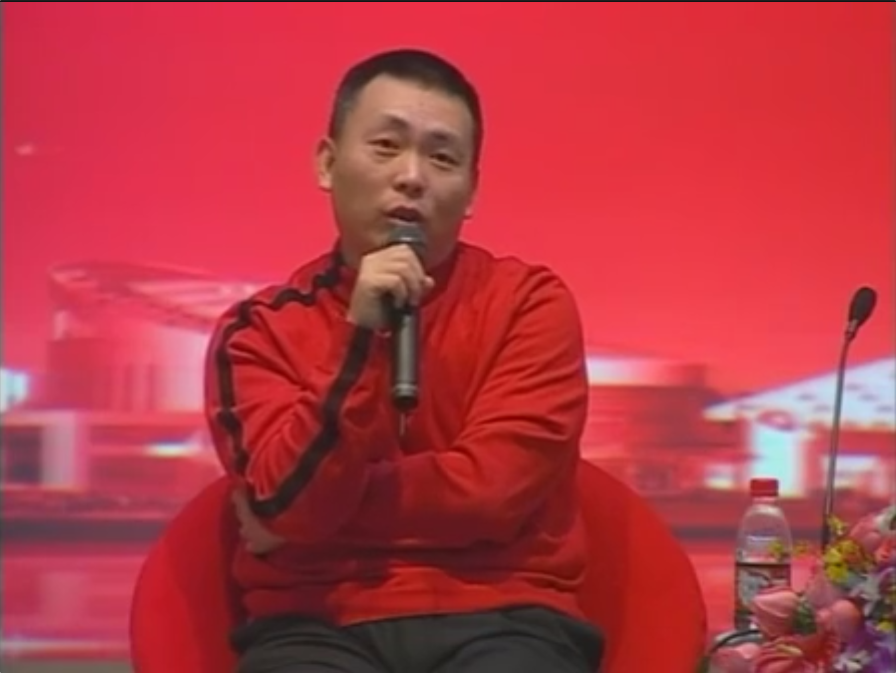
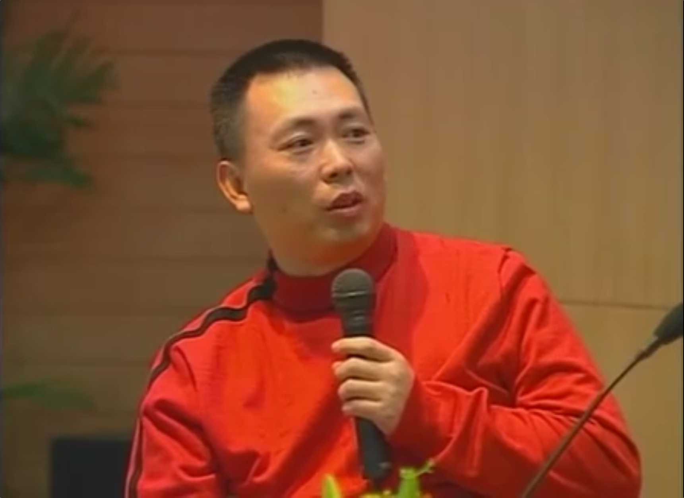

# 2008-[[段永平]]浙大分享

  

  

（声明：转录文稿未经逐字人工校对，仅供参考，文本中可能存在错误、遗漏或不准确之处，一切内容请以原视频为准。）

**00:05** 【主持人】  
欢迎大家来到自立成长与段永平学长面对面交流会的现场。首先请允许我荣幸地向大家介绍今天来到我们现场的各位老师，他们是来自发展联络办公室以及学工部的各位老师们，让我们用热烈的掌声欢迎他们。  

**00:35** 【主持人】  
今天我们访谈的这位嘉宾呢，也曾经是一名浙大的求是学子。他曾经是小霸王电子工业公司的总经理，同时呢他也是广州[[步步高]]电子工业有限公司的创始人。他目前正在从事金融投资业。在前年，也就是2006年9月的时候，他以及他的夫人刘昕女士和[[丁磊]]先生，共同捐赠了4000万美金给我们浙江大学。他就是我们所熟知的段永平学长。  

**01:14** 【主持人】  
首先我们有请浙江大学常务副校长倪明江教授致辞。  

**01:33** 【倪明江】  
尊敬的段永平校友，老师们，同学们，晚上好。今天呢我们非常高兴地请来了我们学校的杰出的校友段永平学长在这里和我们同学见面交流。  

**01:49** 【倪明江】  
大家知道段永平校友是在1983年毕业于我们浙江大学的无线电系。1989年他南下广东创业，五年内将一个行将倒闭的一个小厂做成当时产值10亿的小霸王电子工业公司。1995年，段永平校友在广东东莞成立了步步高电子有限公司，并很快使步步高成为中国的一个著名的品牌。  

**02:21** 【倪明江】  
2001年，段永平校友到美国去开始金融投资事业，并获得了很大的成功，在美国的华人投资圈中被誉为“段菲特”。段永平校友对我们母校、对老师有深厚的感情。离开母校以后呢，他长期的关注母校的发展，念念不忘老师的培育之情，从各方面关心支持学校的发展。  

**02:49** 【倪明江】  
2006年，段永平校友携夫人刘昕女士还联手了[[网易]]总裁丁磊先生，向浙江大学募集捐赠4000万美元，支持学校的建设。成为浙江大学历史上，实际上也是我们国内教育界的历史上收到的最大的一笔捐赠，在海内外引起了非常大的反响。  

**03:16** 【倪明江】  
今天的访谈的主题是“自立·成长”。那么在这里呢，我想代表学校，也代表我们在这里的同学们，感谢段永平学长能够在百忙之中抽出时间和在座的师弟师妹们面对面的交流。我相信今天的交流会使我们在成长的道路上得到很宝贵的教益。我也相信今天的交流一定会成为我们许多同学在人生道路上一个难忘的回忆。最后再次感谢段永平学长。  

**04:00** 【主持人】  
好了，让我们再次感谢倪教授的精彩发言。那么接下来我们就正式进入今天的访谈环节，有请我们的段学长。  

**04:33** 【段永平】  
大家晚上好。  

**04:39** 【主持人】  
段学长，您这次到我们浙江大学来，我们浙江大学可谓是激起了一阵不小的轰动。大家对您此次来的目的呢都非常的好奇，也非常的关注。那么您能首先给大家说一说这次回访母校的初衷是什么吗？  

**04:57** 【段永平】  
主要的……就是前段时间那个张老师去美国嘛，因为我们实际上前年了哈，就是这个捐了一笔钱给浙大嘛，其中有一个叫做这个“自立贷学金”的。那么，张老师跟我讲说申请的人还非常少。  

**05:19** 【段永平】  
那么当然这个可能一方面是因为大环境有些变化，国家现在呢都花了很多钱。还有一个呢就是，因为我们设立这个贷学金下来的话，也是希望从某些角度帮到我们的同学。那么我是觉得有可能是宣传不够，也可能是我们设立的时候的理解不够。包括你给我写那个Email，里面就没有提到“自立”两个字，一开始第一次的时候。那这个字有没有这两个字是差很远的，这个意义完全不一样。因为各种各样的助学金非常多，但我觉得我们这个呢是有一些特别的意义。  

**05:58** 【段永平】  
所以我想，我那时候就跟张老师说，说我就正好我最近要回来一趟，我说我一来呢，我想就找个时间来跟大家交流一下，就看看我们第一有没有必要做下去，第二要不要做哪些改进。我也想听听这个大家的意见。  

**06:16** 【主持人】  
是的，每一位同学呢在桌上呢，在你进场的时候都可以发现你们的桌上已经有了一本很薄的小册子。这一本小册子其实就是介绍……为这次的心平自立贷学金进行了一个简要的介绍。它其实是在前年，也就是2006年9月的时候，段学长以及其夫人刘昕女士和丁磊先生筹集了4000万的美元捐赠给我们学校。它主要是用于等额配比基金、心平奖学金、心平自立贷学金以及认捐浙大紫金港校区图书馆的款项。  

**06:56** 【主持人】  
那么今天我们主要呢就是要就这个“心平自立贷学金”的一些更细节的一些情况，让大家有一个更细致的了解。我知道这个，就像刚才那个段学长说的一样，我在一开始有一点疏忽，就是没有提到“自立”二字。我想呢顾名思义，心平自立贷学金一定是有它非常深刻的含义在里边的，尤其是自立这两个字。那么段学长是怎样理解的？一开始为什么要这么说？是自立。  

**07:28** 【段永平】  
最早来源这个想法呢是来源于那个周老师啊，周敬华老师跟我讲，说这里有些同学呢，家庭也没有到那么贫困的地步，那么生活费上呢也不算是很充裕。那么如果让他一二年级就去自己赚钱呢，又会耽误学业。那么我想想觉得也非常有道理。因为我是觉得一二年级你去打工去赚钱，是你人生当中可能效率最低的时候。就是说呢，凭你这点本事赚不了多少钱，但是你花的时间呢，可确是你最宝贵的时间。  

**08:08** 【段永平】  
所以我觉得如果呢我们能够设立一个这样的助学金，能够去……后来改成叫贷学金了啊，叫到现在我都觉得挺怪的。我觉得做……但是大家说叫助学金呢大家觉得助学金习惯都是不用还的。我们贷学金是要还的。还也不是还给我，还也是还给我们这个基金。我这个钱捐出来就捐出来了啊。  

**08:29** 【段永平】  
那么所以后来就设立了这样一个东西。那主要的目的呢就是想帮助，就是说，因为我在美国待的时间也长了，我看见很多学生他其实都是靠自己，而不是靠家里头给钱。那么像这个呢，我觉得有一个最大的好处就是说呢，大多数学生呢你可以直接从这里贷款去维护……就是说去用于你自己的生活开销，那这样的话呢你可能就可以跟家里少要一些钱。  

**08:56** 【段永平】  
那么要求的条件也是比较……我想大家可能也能看，也是比较简单了。第一呢就是要求的你学业上头要过得去，就是排名要在……比方说排名在前三分之二。就比方30个人里头你能排进前20名。然后呢，没有两门以上的补考。不能够有这个舞弊的行为，这是我特别强调的，也就是我想跟大家灌输一个这个叫做诚信的概念。那么还有一个就是不能够有受过校纪处分这样的一个要求。这种人呢你都可以申请贷款。  

**09:34** 【段永平】  
那如果超过我们能够提供的金额呢就要抽签，如果是不到的话呢你肯定就可以贷。那么贷呢，那么学校给出一个上限，你比方说它是根据当地的生活水准，因为我们考虑得很长远，现在说5000块钱，也可能以后5000块钱就够买一碗面条的，那你5000块钱没有用。所以它是随着这个生活水平呢去调整。但那个是作为你的上限。你比方说现在5000块钱，你说我不需要借那么多钱，那你也可以申请1000，如果需要的话。  

**10:02** 【段永平】  
但是呢，我们这个是要还的。还会是还回这个基金。那么是要求在工作10年……就是不是工作，就是这个大学毕业以后10年内你要还清。那么他也计息。那么计息的话是按银行的大额存款利率。就是你把这个钱你借了以后你存在银行，它那个利息呢就肯定是不会低过这个数。那么大体上就是这样一个概念。  

**10:31** 【段永平】  
那么这里头为什么……也因为有些问题就有人问过我了啊，就是你能不能不收利息？那我要借钱本来就是该收利息的。那么不收呢这个就不知道借的叫什么钱，对吧？  

**10:43** 【主持人】  
如果这样的话，那我们和国家助学金就没有区别了。  

**10:46** 【段永平】  
对，我呢反正肯定不会想着要跟国家抢着花钱啊，这个不不是我的事儿。我想呢，但是呢这个东西到底是不是有这样的需求，其实我心里并没有太大的把握。我们当然也有一些条件，就是要求呢家长要知道。  

**11:02** 【段永平】  
那么我最重要的就是能够帮助同学去自立。就是我我可以很早就不不用家里的钱了，不过我将来自己来还。那我想这个……不知道这个东西对于我们现在的这个同学来讲呢，它有多大的这个……这个……意义啊。有些人觉得反正家里能给钱我就让家里一直给着，那这个我觉得我们的家长确实也都这样。不光是你们，我包括我自己，我母亲都是一样。  

**11:32** 【段永平】  
我在，我是记得我到小霸王我都做厂长都做了好几年了，我母亲还在给我汇钱。每个月给我汇50块。我怎么跟她讲没有用。后来我就想我怎么才能让我妈妈不给我汇钱。但我告诉她，我是这个钱是够用的。后来突然想出一个主意，我每个月给她汇500。噢我妈一看，噢你能给我汇钱了，看来是不用我再汇钱了。然后我我我记得我母亲就把我汇的所有的钱都存在那个地方，说万一儿子哪天需要我还能再给他。  

**12:00** 【段永平】  
所以这个我们的这种……我们这个父母啊它是这天下父母心是这样。但是作为子女来讲，你要不要去说服父母说我现在不想用父母的钱，我就想自立。那么这个大家也要注意，你也不能伤了感情，大家觉得干嘛你不要我的钱，你可能有时候有困难啊。所以我想这也是一种，为什么今天想来交流，这是一个很重要的因素。我也想听听大家怎么看，还包括大家看到这些东西里面觉得哪些东西需要改进的。我们这些东西都还是可以改的。但是呢，总的来讲确实是这样，花钱确实比赚钱难。有时候你想找到一个花钱要花好的地方有时候确实不容易。  

**12:40** 【主持人】  
所以我们可以看出来这个是一个非常好的理念，就是要培养大家一种自立自强的一种素质吧，我觉得应该是。那么有很多同学就会问了，段学长去过那么多的国家，到过那么多所名校、世界名校，那么您觉得就是……为什么国外会以一种贷学金的形式来帮助同学完成一二年级的学业，而现在我们国内很多大学还停留在就是给同学们提供一种助学金的方……这这个阶段来帮助大家来完成学业呢？  

**13:18** 【段永平】  
我想形式是各种各样的，就每个人根据自己的需求。因为我们这个其实指的是以生活费为主，那没有……其实包括学费可能就更多。那么你真的付不起学费的话呢，包括学校，这包括国家，我看这两年我们国家在这上面花的力气也很大。这个当然是绝对是好事了。  

**13:42** 【段永平】  
我觉得西方很多学校呢他是靠募捐，然后呢像很多好的学校就是绝对不让一个优秀的学生因为没有钱而上不了我们学校。那我想现在我们国内的大学其实大部分、至少好的大学其实也都差不多能够做到这个东西了。我们这种做法呢，我也其实也没有也不知道国外的学校他是不是这样做的。因为国外的学校也是很多很多种，奖学金呐、助学金呐、包括贷款呐都是可以申请的。但他都是以奖学金的形式为主。  

**14:15** 【段永平】  
但是我相信呢，就我看到的情况，大部分学生都是要靠贷款才能够支撑完他的学业。而且像西方这种呢他很多因为他的学费，包括学费，我们这个只有生活费嘛，那包括学费在内很多人是要还款是要还一辈子的。我认识很多人到40多岁、50多岁钱还没有还完呢。  

**14:35** 【段永平】  
那我们这个只是因为金额也不高嘛，只有两年，所以我当时算过账，我想10年是一个不大的负担。应该是还款不是一个太大的问题。当然呢我们这还有一些很很有意思的东西，就是说如果他不还的话怎么办？不还呢学校，我也不希望学校本来是花在学生身上的钱是10块钱，然后为了追这个款要花掉20块，那我觉得就不合算了。所以我们是用一个道德约束的办法。就是说呢在网站上公布，就到期还不了钱的人我就直接公布他的名字。你是哪年哪个班的某某某，没有还这个自立贷学金，或者说还剩多少钱没还了。只能用这个来约束了，因为不然的话别的成本会更高。  

**15:26** 【主持人】  
其实就像您刚说的一样，这个这个自立贷学金不仅培养的是学生的自立自强的一种素质，另外呢其实还设立涉汲到了一个当代大学生一个诚信的问题。那现在呢我想大家可能注意到了，在前边第一排有几位比较特殊的同学今天也来到了我们的现场。  

**15:50** 【主持人】  
那么简单向大家介绍一下，这几位同学呢是第一届申请了这个心平自立贷学金的同学们。今天呢他们非常幸运的来到了现场，然后也非常幸运的要和我们的段学长进行面对面的交流。那么接下来呢我们就请上其中的两位同学好吗？然后看看他们心里的所想所感。  

**16:21** 【主持人】  
好，你们俩可以先做一下自我介绍。  

**16:46** 【姜在乐】  
我是来自生仪学院电仪0703班的姜在乐。  

**16:51** 【陈栋】  
段学长好，大家好。我是理科试验班0705的，我叫陈栋。  

**16:58** 【主持人】  
就是说你们两个都是07级的新生是吧？那一开始是通过什么样的渠道了解到有这样一个自立贷学金的呢？  

**17:08** 【姜在乐】  
就是我从录取通知书邮到我们家，当然是我当时非常高兴。然后那个录取通知书的里边还有一个那个介绍、学校介绍里面就有说，有这么一个心平自贷学金。所以我当时就更高兴了。因为这个绝对不是锦上添花，因为考上大学当然挺高兴的，然后由于当时家庭情况不是特别好，所以对那个学费还有生活费其实挺犯愁的。然后这个时候又告诉我可以做这个贷学金，所以当时的感觉是雪中送炭的感觉。  

**17:46** 【陈栋】  
其实我刚开始没有想到要贷贷款或者什么的。开学的时候我们学院有一系列的讲座，然后其中一个就是关于贷学金的一个宣讲会。然后我去参加，那老师讲得太诱人了，然后我觉得这个心平贷学金真的非常的适合我，所以我就贷了。  

**18:12** 【主持人】  
就是“我喜欢，我选择”哈。好，我想我觉得有一点可能是大家在座都非常关注的，就是这个整个申请的一个过程到底是怎么样的？你们经历了一个怎么样的过程才成功的申请到了这样一个贷学金的？先从你开始。  

**18:28** 【姜在乐】  
我想这个申请的过程，是学工部的老师还有那个同学非常负责任。当时刚到学校的时候大家比较忙，就是不是忙，就是对生活不是很适应，很多事情都安排不过来。然后就是每次都是学工部的老师用短信或者是打电话的方式提醒我们去学工部去签字，还有先了解情况然后签字，然后最后从发放贷款什么直接都是学工部老师负责给我们就是给我们提醒，然后我们每次都赶到就可以了。  

**19:05** 【陈栋】  
那我说一下那个具体的一些流程吧。其实开始的时候是在网上下载一个表格。这网上自源非常丰富嘛，你直接下载就行了。然后你只要填好你的个人信息，到你的办公室老师那里去盖个章，再交到学工部。你就，如果一切条件都符合的话，他只要等待这个时间到了就行了。  

**19:37** 【主持人】  
我还想知道是二位在申请完这个贷学金之后呢，心里有什么感受？我觉得这也是大家特别想和你们分享的地方。  

**19:48** 【姜在乐】  
我觉得因为我当时就是对这个贷学金就抱有很大希望，申请下来之后也比较高兴，解了家里的燃眉之急。从我自己的角度，他又给我……在学校的生活施加了一点压力。就是说，我现在需要在学校，就是有一……有一种动力。他……他要求我在学校不能放松，要求我在以后的生活中也要……因为我现在属于是一个有债的人。我需要……我需要好好学习，然后把自己的能力提高起来，然后以后再有能力好把这个钱还上。所以说，当时我的感觉就是既解了家里的那个燃眉之急，又让我有了学习的动力。  

**20:40** 【主持人】  
这叫化压力为动力。那你们呢？  

**20:00** 【男生A】  
可以解了家里的燃眉之急。然后我从我自己的角度，它又在学校的生活给我施加了一点压力。就是说我现在在学校不能放松，要求我在以后的生活中也要努力，因为我现在属于一个有债的人。我需要好好学习，把自己的能力提高起来，以后有能力好把这个钱还上。所以说当时我的感觉就是，既解了家里的燃眉之急，又让我有了学习的动力。  

**20:43** 【男生B】  
当我知道我申请成功之后，我做的第一件事就是马上给家里打电话，告诉我妈说：“妈，你从今以后不用给我汇款了。” 就不再是一个自身（家庭）的负担了吧，虽然还不是那种真正意义上的独立。平时在学习方面就像他说的，更有一种动力感。在经济上的话完全独立了，因为物质是保障嘛，在学习上似乎也更加自觉了，好像真的成为一个独立的个体。  

**21:22** 【主持人】  
那我们大家会说，这两位都觉得这个贷学金这么好，那它究竟好在何处呢？就是究竟到目前为止有什么特别实实在在的一些好处、收益，觉得特别棒的地方？  

**21:43** 【男生A】  
我觉得这个贷学金首先第一点，令我非常……就是让我学到很多东西的，就是它那个利息的计算方式。我们平常认为一个贷学金是为了学生设立的话，应该是不要利息的。但是当我看到说这个是“一年定期存款利息”的时候，我就感觉好像是段学长给我们做了一个实验。就是在一个实验里，杯子装满了沙子，然后段学长告诉我，这个杯子没满，他还能往里倒水。就是说让我们知道，其实我们还要有一种严谨的态度，还有思维要全面。有很多东西我们认为实际上已经做到极限了，实际上还有很多事要做。  
再有就是申请到这个贷款之后，因为已经不需要家里汇钱了，有一种成就感。其实本身大家并没有说一定要自立的那种观念，并不是说非得自立不可，但是由于这个贷学金的设立，让我们真正体会到了自立的感觉。当我们体会到这种感觉之后，我们就会想做，而且会觉得这种感觉非常好。  

**23:03** 【男生B】  
因为心平（贷学金），我觉得最大好处就是它不是学校里少数几个专门针对贫困生的贷学金。所以的话，这个给更多的人提供了这种能够在大学里自立的可能性。像我这样的话，如果没有这个贷款，可能还是得靠家里给我钱，因为要靠打工的话时间上根本不允许。另外一个我觉得这个好处的话，因为它是每个月的资金，应该是说不多不少吧，可以在生活上刚好给你保障，但又不至于你太挥霍，我觉得这个都是挺合理的。  

**23:54** 【主持人】  
我觉得刚才他们两位有一点让我觉得特别受启发。就是这个心平自立贷学金的最大好处，就是能够让在校大学生的受益面扩大很多。因为它不仅仅是针对贫困生的，非贫困生也可以申请这个贷学金。  

**24:13** 【段永平】  
这句话他刚才讲得对，我们不是针对贫困生的。不是“不仅仅”，是根本就不是针对贫困生的。我们就叫“自立”。跟你是贫是困没关系。这个当然对我们执行起来也有很大的好处。其实申请的难度逻辑上也不大，而且第一学期就更不大了，还不考虑你的成绩。第二学期要考虑你第一学期的成绩，我是比较老土了，我们还是按两个学期计算的。大概是这样一个概念。所以他说的这个自立的概念也确实是我们在设立这个贷学金的时候想做的很重要的一部分。所以为什么一定要让家长签字就这个道理。家长不知道你在学校拿了钱了，这个不行。所以你看我们的要求家长是一定要知道的。因为有很多这些细节的东西在里头吧。  

**25:20** 【主持人】  
那行。现在段学长就坐在你们二位的面前，有什么心里话想对他说吗？  

**25:29** 【男生A】  
首先当然要非常感谢段学长给我们大家一个机会，让我们能够摆脱家里，让自己经济独立起来。虽然说经济独立并不是能代表整个人就可以独立于社会，但是经济独立给我们从某个方面找到了一个突破，让我们在以后的生活中能尽量的独立，培养自己独立的思维。非常感谢段学长给我们这个机会。其次呢，我作为一个贫困生，我也非常感谢段学长，因为是从两个方面，从我和我的父母都是受益者，让我的父母不用再为我的生活费发愁了。所以在这两个方面都非常感谢段学长对我们的帮助。  

**26:24** 【男生B】  
首先我也想感谢段学长，真的是再多的感谢都不为过。段学长为我们浙大捐了4000万美元的话，这一笔数目真是……非常人能够做到的。另外呢，我刚开始非常惊讶的就是，原来段学长也是普通人，也是和我们一样的。我以为他会进来的时候场面会非常的壮大，衣着非常的各种光鲜，然后排场非常的大。  

**27:09** 【主持人】  
然后戴着一副墨镜，然后身边还跟着 Bodyguard 是吗？  

**27:14** 【男生B】  
对对对。所以看来名人也是普通人，这是我的误导。  

**27:23** 【主持人】  
我知道今天这两位同学是带着非常多的疑问来的，其实他们还有很多自己非常感兴趣的问题想跟您面对面交流一下。那么接下来我们就听听他们心里是怎么想的好吗？  

**27:46** 【男生A】  
就是首先我看到这个贷学金的名字里有是“心平自立贷学金”。我对段学长这种成功人士比较感兴趣，我想问一下段学长，您是在什么时候就有了“自立”这个概念的呢？  

**28:04** 【段永平】  
我还确实不太知道，想不起来。我觉得人都是逼出来的吧，逼得要自立的时候你就得自立。我觉得所以你这个说法还比较好，就当你贷了这笔款以后啊，你会有一种自立了的感觉，其实会让你更早成熟。那么这个也是我们设立这个贷学金的时候是有这种希望在里头。通过你嘴里说出来我的感觉还是不一样，我觉得很高兴，有人能够体会到这一点。  
因为我现在不是很清楚的是，我们这个是因为大家不需要，还是因为我们的宣传不够，还是因为大家没有花时间去理解它。那么我们也是觉得就是说，我们还可以再花一些时间，再等个一年两年啊，看有多少人会知道。还有一个就是我们时间的长短，是到二年级呢，还是不是需要再延长一点呢？就很多东西其实我们还是可以改变的。  
因为去年张老师告诉我总共只有13个学生申请。那这个我是多少是有点意外。那么因为我想着因为每年有这么多学生嘛。但后来我问过老师，他说现在因为国家的这个投放的金额也大多了，那么加上其实本来也没有那么多学生真的需要。所以我还想再看一看，看到底有多少学生。但这个东西跟是不是贫困呢，它没有特别大的关系。我觉得他是很有勇气，他说自己是贫困生。那大部分人他不愿意说，即使是是他也不愿意说，因为有个面子问题。我们在设立这个自立助学金的时候本来就考虑到这个问题，所以我们特别提出来我们不针对贫困生。就是说你拿这个东西呢，也不需要考虑这个东西了。因为我觉得他这个确实还是非常有勇气，很了不起这一生。  

**29:57** 【男生A】  
我觉得我跟段学长一样，也是被逼出来的。（段：人是要逼一逼才会有点东西。）  

**30:08** 【男生B】  
我对段学长印象最深的就是，我以前看到一则新闻，说是你跟股神[[巴菲特]]共进午餐的那件事情。所以我对这个非常感兴趣，我其实一直想问您本人，现在终于有机会了。我想问一下，你觉得用62万美金共进午餐的话，你觉得这钱值吗？  

**30:38** 【段永平】  
你是说我买到什么东西了吗？  

**30:40** 【男生B】  
对对。  

**30:42** 【段永平】  
首先要说明呢，吃这顿饭呢都是他花的钱。我一分钱没花，连最后的小费都是他给的，因为我忘了。他站起来从那个大皮包里头掏出100块钱放在桌上。  
我们是一个心平基金会，基金会每年都是要花一些钱的。那么那一年呢反正他有个这样的拍卖机会，就等于是把钱花到他指定的那个叫做 Glide Foundation 里头去了。我让你想，那个钱花的跟我花的折价的钱比，那个简直不算什么对吧。  
那么，62万……是62万美金吗？（旁白：62万美金。）其实也确实没往心里去。就是说，我刚刚讲这个就是说，赚钱容易花钱难。但你会赚钱的呢，你在一个熟悉的地方；那么花钱的时候要花不同的地方，确实有点难。那么他告诉那个地方可以花钱，让你去花，那对我来讲那就还好了。  
最重要的是，我确实因为有了巴菲特，因为我看了他的东西，从他身上学到的东西帮我赚了这个钱，那是远远不是这一点啦，也不止10倍20倍的概念，那是远远远远多过这个数字。包括给浙大捐的这些钱，那都是我看了他的东西以后赚来的。所以大家觉得那顿午餐值还是不值？  
所以他不是说买到一个东西，也不是说他能够给我一个锦囊妙计，给一个什么小布袋里面塞两张纸条，关键的时候打开来看一下。不是这样一个东西。它是一些……我觉得很难言传的东西，是一些意会，是一些悟道的东西。  

**32:45** 【男生A】  
就是说从人文角度上讲，去吃这顿饭。  

**32:53** 【段永平】  
其实说不清楚。其实我好多年前就想去，那么一直就没有去的原因呢是觉得自己英语太烂了。我要有他的英语水平我早就去了。那时候还更便宜一些。你看去年拍的好像比我那个还贵，还是跟去年跟我拍没拍过的那个人，今年又跑出来拍了，终于给拍到了。他拍了五年还是六年，终于最后想通了，下了决心了。我是第一次拍我就说我一定要拍到，多少钱我都会拍的。因为多少钱对我来讲都是一样的，它其实没区别在这个地方。  
这个确实是没有区别。但这个东西呢我不知道，这个东西能够理解的人呢其实是不多的。因为我看过这个大部分都是比较负面的状态来看，说哎呀还有多少人上不起学啊这个东西。我说我花钱干你什么事儿啊，不因见了鬼了吗对吧。你提意见没道理的。  
我觉得这个东西啊，做慈善这个东西啊，跟你有什么钱是没关的。那么很多人觉得啊你富人都应该去捐钱。我今天我刚看的就说吉林有一个叫做什么基金会，做20几年就是捐助这个叫做“两特”学生，就特困和特优秀的学生。那这些都是很普通的老师。那我想有很多很普通的人，他们都是眼睛盯着那些所谓的有钱人。  
那么其实我觉得最重要的是大家没有真的自己去去想。而且我觉得我个人做慈善、做捐赠也不是从有钱以后才开始的。我觉得会不会捐其实跟你有没有钱不一定有那么大的关系，是一种心态，是一种对社会的理解。  
其实一个人的自己能够用的钱非常有限。当你不管是因为运气也是因为各种各样的原因你有了钱了，那其实要去考虑这个钱怎么花。像我捐的这都是我的遗产，说句心里话。但我不能等死了以后捐啊，你要像龚如心那样你就惨了对不对？好不容易打个官司赢了钱还得再让人家继续打下去，这多不值呢。  
我不知道在我这个年龄写好遗嘱的人有多少，我是早就写好了。这就是对人生的一个很客观的面对。就这面对的东西，你早晚都有这一天，那你既然知道有这一天，为什么不早点处理呢？那么钱这个东西呢，我个人能够花的钱很有限，多出来的钱其实就是麻烦。如果我用这个麻烦还能帮到别人，还解了我的麻烦，没什么不好。数字不是一个问题。数字就是说，我也没说真的把我的钱100%都捐掉了。就算我不管我捐了多大的比重，我自己生活的钱我还是有的。  
所以我想数字上呢，大小并没有意义。就是说只要是看你有多大的能力，你去做多大的事。当时为什么捐了这个数字也是很随意的了。我跟邹老师讲，我说我开始的目标是不要做最大的。后来说着说着不知道怎么就说成这个数字了。说这个数已经超过别人的了，我说哎呀那就超过就超过了。无所谓，我看看我现在好像能捐得了，我就捐了。我觉得也不是说很在意这个事情。  

**34:52** 【男生A】  
段学长认为捐钱是不分条件的，不过我想捐钱应该是理由的吧。那段学长为浙大捐了4000万美元，这个这么大个数目，你当时是不是浙大的那个老师或者是学校肯定是给你受益……让你受益匪浅，能举出一个就是对你印象比较深刻的事情，或者是印象最深刻的事情？  

**35:19** 【段永平】  
捐钱的数目其实是这样，就是说呢，我……我说捐慈善这个东西呢，其实是……  
那么说感情的东西呢，我觉得……浙大呢，就你说有什么很特别的某一件事呢，我觉得也很难，说因为某一件事就要捐4000万，这好像有点怪异啊。我觉得这个是整个感觉吧。就是说呢，在学校的时候呢，我觉得我们的老师啊，包括同学之间的交流啊都还是挺多的，老师对大家都挺关心。那么毕业了以后呢，我记得这个……就我觉得老师对我们还一直都很关心。你包括这个像邹老师啊，像黄老师啊，就在我们毕业以后……我记得好像在北京的时候也去过，这个我在广东的时候他也都去过。那么他一直都在跟踪。那这个东西他不是因为我赚到钱了才开始认识我，是我们一直都保持联络。然后不小心碰上有一个人就赚到钱了，就捐一点。我觉得这个也很自然啦。  
我也不是光我捐了，其实有很多同学都捐了。包括后来我们在信电系搞那个搞了一个平安基金，就是给退休老师的。总共最后募了多少钱那个？（旁白：50万美金。）对，50万美金再配比就配了100万美金了等于。是这样一个概念吗？肯定不止25万……不止。  
是40万美金是吧？因为我知道的人捐的钱就不止20万。所以是肯定不止。  
所以大概就是这样一个概念。  

**36:24** 【主持人】  
那两位同学还有没有问题？  

**36:28** 【男生B】  
好，我可以来问个问题。我有一个问题就是说，其实您的本科是在浙江大学读的，那么后来您研究生是在人民大学读的。这个问题是，您为什么会想到到浙江大学来捐4000万呢？而不说到人民大学去……  

**36:52** 【段永平】  
这个像是人大的同学问的问题啊。（笑）  

这个我们还是不说了吧。我觉得确实浙大跟我的联络比较多，而且正好碰巧。包括我认识的老师也多。人大呢我现在就找不到一个我认识的老师，所以也不……人家找我也都不知道我是谁。所以相对来讲其实也有找也有聊了，但是还有一个就是有个信任度的问题。就是说我不熟悉呢，我就很难相信他们会把这个钱花好。  

我记得上次张书记就讲说这个信任，我说这个信任不是现在能够建立的，那是几十年前建立的。就是你在学校的时候你就不相信他，不可能说过了20年突然就觉得他们能花好你这个钱。  

所以花钱有时候也是一个比较难的事。你想巴菲特他捐了300多个亿给比尔盖茨。好像是300多个亿，他85%的身价，370多亿对吧。那就是他运气的地方。就他找到了一个人，他给300多亿他能把钱花好，这是他的运气。那如果找不到这个人，他那钱怎么花呢？那也是个麻烦事儿。所以我觉得能够把钱捐给浙大呢，其实也是我的运气。要不然我怎么花呢？所以大家要从这个角度去理解。谢谢。  

**40:00** 【段永平】  
所以是不容易的，你要信任一个人，它是要花很多年的。所以他认识比尔·盖茨确实也是非常非常多年了，而且一直都打交道。我在网上有时候看到他们打桥牌啊什么的也在一起，非常有意思。那网上其实...我不想告诉大家密码嘛，我也是无意中知道的，有时候跑去看看他们打牌，挺好玩的。  

**40:27** 【主持人】  
那有人说啊，您是中国的巴菲特，您对这个称号有什么看法，有什么想法？  

**40:35** 【段永平】  
我肯定不是，我也不想做。我是胸无大志，做到哪算哪。我也不是很想把投资作为事业，我这个投资就是一个爱好，就是一个兴趣，就像大家喜欢踢球一样，我喜欢做投资，我觉得好玩。但我大部分时间呢，其实现在都是属于带带孩子啊，我也玩游戏啊。  

但我经常在网上看见有些玩游戏的学生，有些不知道是哪个学校的，反正也有一些是大学生，有些过度沉迷。也有些好学生，一个礼拜就看他就是礼拜六、礼拜天上来两个小时，一天一个小时。我说这个是好学生，他就很严格地在周末上来，平时绝对见不到。我在游戏里头我也带徒弟啊也是，看得到他上线记录。但是有些学生就比较糟糕，说“哎呀考试挂一哭脸，又挂了”。我说那你怎么还有时间玩游戏？“哎，再说吧。”  

但是呢这个不影响。因为我玩游戏跟我做投资有很大关系，因为我投资投在游戏上，所以我很想去了解游戏里头大家这个玩家的心态都是些什么样的人呢，所以我想做一些预测。包括我也想看游戏好不好玩。那么投资本身对我来讲也是挺有乐趣，也是挺有挑战的。确实它也是一个很长期可以做的事情。因为我现在不适合在一线做，因为我家搬过去了，家在那边，我不可能整天待在这儿。所以做投资也算是对我来讲是一个很好打发时间的一个事情。而且我也帮很多人做投资，所以也肩负了很大的责任。  

**42:28** 【主持人】  
那在帮其他人做投资的时候，会觉得...因为投资嘛要冒很大风险，会觉得压力很大吗？  

**42:36** 【段永平】  
我还好，因为我帮的这些所谓的其他人呢，都是自己比较熟悉的人，我不是公募的。所以我都知道这些都是有钱人，而且都说好了，谁亏了钱也不许骂人的。你可以把钱拿走，三年可以拿一次，你想随时拿还不行，平时你还不让问。谁问，我跟谁急，对吧。大家就不敢问了，就完了。然后很多人过去也都赚到钱了。加上这些人大部分都是我们多年共事、合作、一起发展起来的这些朋友、熟人，所以我倒没什么太大的压力。我跟基金还是不太一样，基金是每年你都要算账，然后要跟大盘比。我这个是“深一脚浅一脚”，因为我们这种投资的方法呢，它不是跟大盘走。巴菲特他也不是每年都一定保证能够比大盘强的，但是你长期来看他是比大盘强。那巴菲特水平肯定比我高嘛，对我吧。所以我投资总体水平要比他差一点也很正常，所以我没什么压力。  

**43:47** 【主持人】  
好，那就感谢我们在座这两位同学。那么接下来呢，是我们的最后一个部分了，就是在座的所有同学都可以向我们的段学长提出问题。好，我已经看到一位同学了，在那边。请我们的工作人员把话筒递给他好吗？  

**44:35** 【廖盛（提问学生）】  
段学长您好，我是您的学弟，浙江大学第九届研究生支教团的廖盛。我之所以提这个问题呢，就是因为听了您对心平自立贷学金的这个介绍，感触非常深。我现在做的，因为我是名志愿者，我在西部支教，我现在所做的主要的一份工作呢，就是在为当地的一些贫困学生联系一些资助也好，或者说一些创造更多的一些机会也好。因为听了您的这个贷学金的一个想法，我非常受启发。因为目前我们做的这个贫困生的资助，绝大多数都是这种捐赠。目前面对这个初中生、高中生等等，还很少有这种所谓的贷学金这种形式。我想问的就是，您有没有这个兴趣，比如说在我们支教的地方，就是浙江大学的第二故乡湄潭县，或者说我们另一个支教点，就四川省凉山州昭觉县，设立这样一个类似的贷学金？谢谢您，谢谢您。  

**45:36** 【段永平】  
我不知道。因为这个它最重要的是有一个约束，就如何去形成一个约束的条件。我们这个贷学金它是要还的。还呢，我对浙大的学生呢，我有一个最基本的信任度。你看这个学生借的钱这么少啊，第一期啊，就说明什么呢？说明至少看得到的人都想这钱要还，我现在我不一定着急借。我要到那种地方去呢，我很难讲。那个钱肯定借得很快，因为大家可能很多人就不打算还。这个我就不知道了，就是我如何去建立这个...信任这个东西非常难建立。就是说呢，像你说的贫困生大部分是用捐助的形式呢，我是可以理解的。但是我自己个人的注意觉得，捐助这个东西呢，因为你可以帮人一时，你很难帮人一世。但是呢有时候这一时又很重要，你不帮下去也不行。所以我想，这个可能恐怕一两句话很难说得清楚。至少我刚才听你讲完了，我一下想不到一个可以执行的办法。最重要的是你要能够执行得下去。这做企业也一样，你有一个好的主意没有用。我想花钱呢其实大家都说花钱难，它不是说难在我要花出去，我乱花很容易。但是你如果...我建立一个这样的东西，我如何保证它确实能够去到那种地方，而且这些人他又能够还回来？  

**47:01** 【廖盛（提问学生）】  
那那个段学长，既然您刚才也提到就是这个可能一两句话也讲不清，我是不是一会可以留下您的联系方式。如果我能够想出一个我认为比较理想的一个能够跟您沟通的方案...  

**47:10** 【段永平】  
没问题，可以，你可以发我的Email，好吗？  

**47:15** 【廖盛（提问学生）】  
好好，那我一会...谢谢您啊，谢谢。  

**47:20** 【段永平】  
非常感谢啊，他是作为一个志愿者。就在中国这个志愿者文化还是不是很普遍，好像好很多，比我们那个年代好很多，但是还是不是那么普遍。在美国就是确实我看到的特别多，Volunteer特别多。我是本来一直都没有去过，我太太经常去做。我是觉得我自己的语言不过关，我也比较懒，所以一般都很少去，但是确实觉得不容易。好，非常谢谢。  

**47:54** 【主持人】  
好，感谢这位同学的提问。还有其他同学吗？好，那边这位同学。  

**48:04** 【提问学生2】  
段学长你好，你是我的比较崇拜的一个人啊。我就想问一下你关于投资方面的一些东西。刚才你讲了你那个合伙制公司，其实就让我想到了巴菲特当年也是有这么一个合伙制的一个公司。那我想问一下，就是你现在那个合伙制...你对自己就是那个投资的那个预期有没有？因为巴菲特好像一年可能有20%几，他就保证不亏钱。这是第一点，第一个问题。第二个问题...  

**48:33** 【段永平】  
那个，我，我说一下规矩啊，我们一个人只问一个问题。好不好？主要的原因不是因为你，我有的时候记不住。就问一个吧。  

**48:42** 【提问学生2】  
那就主要...那就问第二个好了。可能是主要是第二个问题，因为我知道就是巴菲特的话，他可能看一个公司的话，他可能主要看他那个财务报表，财务报表他看的非常精通。然后我想问一下，你是主要是去投资去...大量买入一个公司的时候，你主要是看一些什么东西？主要是关注一些什么东西？好，谢谢。  

**49:06** 【段永平】  
首先我想说呢，巴菲特他看一个公司，并不是像你说的这样只看财务报表。但是呢，他每年花大量的时间看财务报表。看财务报表是一个必要的东西，但他不是一个充分的。就是他很难说看了财务报表就一定能够决定。但是呢有一些公司呢，我也有这种情况，你看财务报表，就很简单，说看完财务报表，发现这公司有三块钱，现在他卖三毛钱，那就买了，对不对？这三块钱卖三毛钱。就那时候我买网易，很多人就问我，说那时候大家都不买，你为什么这么大勇气可以买网易？我说这东西不需要勇气啊，三块钱的东西卖给你，卖一块钱，你要勇气干嘛？理性就可以了。明白这道理吗？这个时候不需要勇气。所以呢，像这种情况呢，它不是靠这个。  

那么我跟巴菲特聊呢，我就跟他讲，我说我对投资，我说从他身上学到的最基本的东西就是说，当我买一只股票的时候，我就是在买这家公司，或者买这家公司的这一部分。然后呢巴菲特给我回Email他说呢，你说的这一点，就正是“我从我的老师那儿学到的那一点”，而且这一点改变了我对投资的...就是投资的...就改变了我的一生。这是巴菲特的原话是这么写的。那么我觉得我从巴菲特身上学到的东西，很多人问我学到什么东西，我说就这一点。就当你在买一个股票的时候，就是在买这家公司。所以呢，你一定要把这家公司搞懂。看财报是一个前提。看完财报是不是就能够决定让你投资呢？未必。但你要不看财报就投了呢？这有点荒唐，对吧？但是你说是不是就非要看了财报才能投呢？也不一定。所以他投资他没有一个很绝对的公式。如果有，每个人都可以做巴菲特了。  

我给你举个再举个特别简单例，就是我们那个，我记得[[黄峥]]问我一个问题，我就觉得问得非常好。说巴菲特去，就黄峥今天也来了啊，就说也是我们浙大毕业的。这个巴菲特这个，他去买别人的公司，对吧？那么他什么样的条件能够决定买这样一家公司？那么我问过巴菲特这个问题。巴菲特说呢，第一，我要觉得这个人他不爱钱；那么他喜欢他那份工作；当然还要愿意以一个他自己，就是巴菲特双方都觉得合式的价钱卖给他。那很多人就不明白了，说如果他不爱钱，他要干嘛要卖给你？然后呢，你又怎么能看出来这个人不爱钱？对吧？然后我都不记得我当时怎么回答，但是我觉得我能够理解巴菲特为什么这么讲。绝大多数人是不懂的。因为呢，他其实很难碰到这样的人。但是我就跟我们公司人讲，就是说你看，我可以去美国，我们公司可以继续运营，我们交了很多钱在我们公司其他的这些人的手头里。如果这些人是一个爱钱的人，我所谓的爱钱就是说，悄悄地把公司的钱往自己口袋里装，我们公司早完了。那这种人好找吗？不好找。所以投资本来就是一个很难的决定。就是你要去花很多时间去琢磨、去理解、去了解你到底在干什么。所以我为什么说我很喜欢这个东西，觉得这个东西确实很有、很有意思。它在很多方面确实是很大的挑战。你要了解他的产品，了解他的技术，了解他的人，尤其是了解人，了解未来的这种发展，很多东西。那当然对我来讲呢，因为我做企业这么多年呢，因为就是对企业本身的这种自身的规律有一定的理解，所以还是有挺大帮助的。  

**52:51** 【主持人】  
好，下一个问题。  

**52:55** 【提问学生3】  
段学长您好，我问一个问题。当时我看过媒体报道，您说做企业就像高台跳水一样，动作越少越好。请问这句话是不是您说的？  

**53:07** 【段永平】  
不知道，是谁就说是我说的？  

**53:11** 【提问学生3】  
因为我在那个报纸上面看到史玉柱说...  

**53:13** 【段永平】  
史玉柱说是我说的。对，但我...我想听听就是说，您对这句话怎么理解？  

**53:20** 【段永平】  
我的原话呢是讲的叫“[[焦点法则]]”，就Focus，就是你必须Focus，就是你你要做你你自己擅长的事情。因为呢，这句话的这个最早的时候呢，中国有一段时间在搞多元化。我就不懂，我说这个多元化，你一个都搞不好。说鸡蛋要放在很多个篮子里头，我说我的观点就鸡蛋就放在一个篮子里头，这样我才看守得住。放八个篮子里头，肯定至少打掉七个，最后那个还守不住，对吧。是怎么来的。那我觉得史玉柱他的理解呢是用他自己的语言表表达出来的。我的原话我不记得曾在任何地方讲过用“高台跳水”这个讲法，但是呢Focus这个讲法我是肯定讲过的。因为我跟史玉柱也比较熟了，因为我们原来在泰安产业会，有时候在一块聊天，那么也聊得过一些事情。那么所以后来我看他这么一讲，我说这原话是怎么讲的？我说我反正不记得，他说我肯定讲过。我说我前段时间我还在旧金山还见到他，我是确实不记得。但是那个道理是一样的。他说高台跳水这个东西就是你动作越少越安全，越简洁。所以他现在要聚焦在这个他喜欢并且熟悉的事情上头。我觉得这个道理其实很简单，但简单的东西是不容易的，很难做到。  

**55:00** 【提问学生4】  
还有一个问题跟刚才那位学长说的一样。我刚听段永平学长说到那个“自立成长”...现在我们浙大有一个关于创业与创新管理强化班，里面很多人呢就是可能比较倾向于去创业，因为现在国家也比较支持。但是呢现在因为因为资金缺乏嘛，就可能创业的启动资金，然后这方面比较缺乏。就是说，那里面的同学也都浙大学生。那刚才段永平学长说对浙大学生还是比较有信任感的。我就觉得这个方案可不可以就是事后跟段永平学长继续讨论一下，就说关于这个基金的设立？  

**55:46** 【段永平】  
我对浙大信任，但是学生要另说了。我不做VC（风险投资），就是因为我不想跟人讨论这种事。因为呢，如果我要做VC或者做Angel Fund这种啊，会有很多人给我很多所谓的Ideas。那么这样我会很累，会改变我的生活方式。所以我为什么不敢去跟人讨论呢？我一讨论我必须评价，说这个东西好还是不好，我愿意做还是不愿意做。你懂我意思吗？所以我这就坚决不参与。不管有什么好的主意，我说你别跟我讲。只有一种情况，就有人说哎能不能给我提点建议啊？我说这个可以。这个作为就是好像我作为一种...其实跟做慈善是一样的。但是呢我要直接介入，我说我不介入。你理解这个意思了吗？因为很多人之前我碰到过很多次有人提这个问题。但我非常感谢你提这个问题啊，这个有个机会我可以说明一下这个情况。  

**56:46** 【主持人】  
好了，下一位同学。这边穿黑色衣服的男生。  

**56:53** 【尹航（提问学生）】  
段师兄您好，我叫尹航，是信电系04年毕业的。首先感谢段师兄这些年来对浙大的支持。尤其您会花这么多时间、这么多精力在学校的发展和教育上面。我觉得这是区别于其他很多慈善家的一个非常不同的点，就是您是真的做慈善的，而很多人是假做慈善的。  

**57:13** 【段永平】  
这我们就不评价了。我觉得做的人其实都还是在做了。这个我还是说一个观点啊，我也不是很赞成去评价人家的慈善行为。只要人家捐钱，不管是怎么捐，不管捐多捐少，善意是一样的。我也很害怕别人评价我，说为什么捐给浙大不捐给人大。我说干你吖什么事？对吧，这有有人说这话，我骂人的是吧。我确实原话那样讲的。  

**57:45** 【尹航（提问学生）】  
在您的“自立成长”这...尤其是“自立”这个概念，在我理解的话，就是第一是经济上独立，才是人格上独立。那么您的话是希望我们大学生的话是这些同学们的话，希望他们首先经济独立，然后自己有个自立自强的一个精神。但是首先的话这里面有个问题，就是现在的学生他对家庭的依赖感太强，经济上的话基本是百分之百依赖于家庭。您看现在07年的话是13个学生，浙大大概招了的话是高考和保送的大概是6000左右。那么6000里面的话只有13个。我想浙大学校的话已经做过很多贡献了，但是以做过很多工作，但是效果的话你看就是这个样子。我想其他学校的话也大概会是这个样子。因为现在学生对家里的依赖实在太多，想让他们自己向学校申请钱以后自己再还，这样的话我觉得是比较难。再一个一点比较难的是，因为我已经毕业三年了，那么我看周围同学里面，他们毕业五年之后的话，其实有很多同学的话经济上的话其实还是有问题。你看现在如果说像现在07年的同学，他贷的话两年话都贷的话大概就是一万左右，一万吧，可能还不到一点。那么他到时候要是几年以后还，第一个的话就是他们到那个时候他们是否会想起这件事情？那么学校有一种什么办法去跟他们沟通？再一个他们的话是否有...  

**58:24** 【段永平】  
学校不需要。你要十年之内不还钱就把你名字挂出来了。  

**58:31** 【尹航（提问学生）】  
但这个挂出来，如果...这当然对这个基金来讲的话，这个基金的话它这个回款率的话大概会有个哪个比例？  

**58:39** 【段永平】  
我相信大多数人是不会忘记的。但是呢有没有这样的人？会有。我想这个不重要。最重要的是有人愿意去承受这个东西就可以了。当然这也是一个尝试，因为我们以前也没做过。我也很想看，我也有耐心。我们这个基金谈了准备直接付到14年。  

如果老是只有十几个人的话，我们基金的规模可能就要缩小，我们可以把钱改作其他的用途。但是其他的用途也不好找。我想这里面到底是什么原因，其实我现在不清楚。我觉得有可能是大家还没有理解，还没有看到。还有一个就是因为我们这是第一届，第一年大家刚进校可能还糊里糊涂的，下半年也许会多一点。所以我想再看个一两年吧。如果说还是人很少，我想再说。  

**60:37** 【段永平】  
“自立”我想这是大家自己的事情。我只是建立这个助学金去帮助大家，但是你扶都扶不起来，跟我也没什么关系。我着急没得急，我不着急，该着急的是大家自己。但是我想从另外一个角度看到，大家不借其实从某种角度是个非常正面的消息。就是大家知道这个钱要还，所以大家会很认真地去想这件事，这可能需要想半年。还有一个就是国家确实投了很多钱进来，所以很多人确实不需要。还有一些家里经济状况可以的，他根本就不需要自己去借这个钱。所以我想关于这个，我们还是先看一看吧，先看个一两年。我不知道你的问题是什么？  

**61:25** 【提问男生A】  
我还没问问题呢。  

**61:26** 【段永平】  
OK，所以大家节约一点时间。  

**61:29** 【提问男生A】  
看您现在是在投网络游戏，中国在纽约纳斯达克上市也就那几家，我也是做网游这方面的。您说过一句话叫“[[敢为天下后]]”，既然是“敢为天下后”，您是敢说，但是其实很多做企业的——我也是自己在做企业，尤其从小企业开始做其实很难，非常难。您以前做过VCD，包括现在做网游，介入时间其实已经算是比较晚一点，而且这个时候行业集中度已经很高，平均利润率已经很低。那您的投资方向，还有您当初的企业，有哪些核心竞争力能够保证您在当初的行业中能够做得好？谢谢。  

**62:17** 【段永平】  
任何一个成功的东西，没有什么东西可以保证的。但是从概率上我也许有一些经验是可以有作用的。首先我要说明“敢为天下后”其实不是我说的。我今天跟其他同学已经讲过了，老子曰：“吾有三宝，一曰慈，二曰俭，三曰不敢为天下先”。当然我以前说“敢为天下后”的时候我不知道，是我太太告诉我说：“你看看人家老子早就说了。”我说原来是我爸说过的这事。  

**62:53** 【段永平】  
说到经验，我觉得做企业非常简单，叫做 Consumer Orientation，叫做“[[消费者导向]]”。这话说起来非常简单，但是真正这样做的人非常少，绝大多数都是生意导向、赚钱导向。只要觉得这个市场足够大，时间足够长，我什么时候介入都不晚。比方说假设这个市场有50年的市场，你说我晚5年有什么关系吗？没有什么关系。  

**63:33** 【段永平】  
你别忘了，中国做游戏最早的鼻祖就是我。我对游戏的理解非常深。这不是说简单赚点钱，我不知道这里有多少人玩过小霸王游戏机或者是学习机。我是记得我在网上玩游戏的时候，我跟他们说我们现在也在考虑做网游。他说：“你现在才做？”我说其实我们很多年前就做了，最早我就做过游戏，而且做得还不错。难道说小霸王其乐无穷？哟，我说你这人还能想起这句话来，这广告词就是我出的。他说：“你不会是段永平吧？”哎哟我说这个人我觉得厉害，一个玩家直接在游戏里就能这么说了。  

**64:22** 【段永平】  
游戏这个东西印象还是挺深刻的。我这个人本人很喜欢玩游戏，我觉得玩游戏没有什么不好。但是凡事你过度了都不好。吃多了会撑着，会发胖；喝酒喝多了会醉死；打麻将咱就不说了；还有赌钱赌疯掉的。所以有些人说玩游戏不好，甚至口诛笔伐，我觉得我当年最早跟《少年儿童报》的卢勤争过，原来叫知心姐姐那个。游戏到底好还是不好？我说凡事都可以分成两面，但是你适度就是好。  

**65:07** 【段永平】  
我觉得玩游戏对于学生也没有什么一定不好。但是像有些同学那样玩，一天花十几个小时泡在里头了，这当然不好，这就不用我说。但是他也知道不好，他也很内疚，但他就是拔不出来。很多人问我怎么办？我说这些人，他玩游戏拔不出来，他玩别的也一样拔不出来，这就是个废人。这跟我游戏有什么关系？没关系。就像有海洛因，你们这么多人都不去吸。海洛因好不好？海洛因当然不好，这是两回事。但是你像香烟、像麻将，它都是自己可以选择的。我觉得玩游戏比这些东西都好，比海洛因那些东西都是要好得多。这是两回事，我自己就很喜欢玩。但是我不会一天在里头泡十几二十个小时，然后说去浙大演讲忘了，我正在打怪升级呢，不会。  

**66:07** 【段永平】  
那么你说我们一定会成功吗？我觉得，其实我说我们做网络游戏其实是因为我做投资。比方说我买网易的股票，包括史玉柱的股票我也有，那么我需要去了解他们的游戏。当然也不排除我们自己做游戏，这种可能性是绝对存在的。虽然是做得晚了一点，其实很多年前就有人跟我提过，我觉得确实我懒了一下。但我看现在这个市场还是很好，我们也在考虑确实我们有可能介入网络游戏。但是不是以步步高的这个公司去做，我们会专门有一个部门。也许你可能过三年五年以后，你会发现有一家这样的网游公司做得还不错，但你未必知道它是跟我们有关系的，我们也未必会说。  

**67:07** 【主持人】  
好的我们继续。后面那位女生。  

**67:21** 【提问女生】  
学长好。我之前看到“心平奖学金”（注：口误，应为贷学金）的时候，一开始看到“贷学金”三个字就不看了。一来我不是贫困生，二来我家也不需要贷款。总是把贷学金跟贫困生联系在一起，要么就是对特优生的奖励。所以到这个会场以后，听你这么讲才知道原来是为了我们在精神上自立、自强，然后才办出来这样一个贷学金，还觉得挺好的，也比较合自己的心意。因为本来也是自己挺想自立的，但家里的父母老把自己当小孩，老跟我这么说：“钱够不够用啊？不够用就问我要。”我就特别希望他们每个月只定额给我多少钱，如果不够的话我自己再想办法，或者我自己理财搞定自己生活。  

**68:19** 【提问女生】  
但是有一个比较严重的问题，这个贷学金，现在物价飞涨，我们在学校里花400块钱在食堂吃饭一点都不算奢侈。而您每月最高提供500块钱，这没法自立啊。  

**68:34** 【段永平】  
那个是学校每年会做调整，是跟着物价指数和我们说的“平均的”生活水准走的。它给你提供的钱也不是让你去奢侈的，就是让你维持一个基本的生活费用。所以，我问过一些同学，他们觉得也还可以。如果你家庭条件本来就很好的话，你可能会觉得并不那么重要。但是你去看看，像你校长还讲原来包玉刚的女儿，包括我知道的李嘉诚的儿子，包括很多很富的人，受过西方教育的人，他们很多小孩就是叫“再富不能富孩子”，就小孩一定要让他穷，穷他才会比较容易自立。  

**69:50** 【段永平】  
我想这个东西其实是给大家可能提供这样一种机会吧。就像刚才那位同学讲的，第一件事跟妈妈讲不用再给我汇钱了，他有一种非常自豪的自立感。但你一说我觉得可能我们学校的宣传看来还是有一点点问题，还是不够。确实就是胡毅给我发email的时候，我马上就给他回了，我说“自立”这两个字是不能够丢的。因为自立比别的都重要。否则你想现在助学金、奖学金、各种各样的贷学金多如牛毛，大家如果说混在一起的话，这就没什么区别。但“自立”这两个字是不一样的，而且像我们这个贷学金申请相对来讲要容易。因为你自己看完这个条件，你基本上可以判断自己能不能够拿得到。其他很多前提可能还要等，我到底能不能够拿得到啊，什么样的条件12345678很多条。这个东西你自己看完你基本上就可以知道，大多数人可以知道我能不能够拿得到。除非申请的人太多，我们可能需要用抽签的办法。从目前来看，没有这个情况的话，其实我想每个人一看就知道自己能不能够拿得到了。所以我想这个再看吧，看看看到底有多少人需要这个东西。要是没有的话，我明年再回来跟您校长再商量一下，我们是不是要再设一个别的什么东西。  

**71:23** 【提问女生】  
我的愿望也就是设立一个比较适当的金额，就自己稍微努力一下就可以通过这个自立，而不是再向家里要钱。太少了的话也不行。  

**71:38** 【段永平】  
你可以向家里要一部分，在这里申请一部分啊。  

**71:43** 【提问女生】  
那就没有特别大的意义了。  

**71:45** 【段永平】  
还是挺大意义，你已经自立了一部分了。这个还是不容易的。而且有些人说5000块钱会不会太多了？你要嫌多你可以申请2000块钱，没有逼你一定要申请满的。那个是一个上限。我想这个规矩大家还是要认真看一下了。我想我有问题大家再提，包括将来跟学校、跟张老师他们提，我们也可以不断地去改进。因为我希望这个东西毕竟能够帮到的同学越多越好嘛。  

**72:26** 【主持人】  
请工作人员把话筒递到这边，红色衣服的男生。  

**72:35** 【提问男生B】  
段学长你好。我想跟大家分享一下，刚才那位同学说钱够不够用。其实你可以直接把钱花到接近于零的时候，去网信做数据工程师赚到钱把自己自立起来，这就是有时候靠自己逼出来的。你爸妈问你钱够不够的时候，明明不够你还是要说够，这样可能会比较好。我就是担心这个贷学金会有这么一个问题，因为利率很低，他们可能会通过其他渠道去做别的（套利）。  

**73:24** 【段永平】  
什么可能都有，所以必须经过家长同意，就你家长要知道这件事。家长不签字我们不能借的。  

**73:35** 【提问男生B】  
这就是我的一个疑虑，就是说可能会有走其他渠道，不是用在你应该觉得用的那个地方。  

**73:41** 【段永平】  
我们没有办法做一个十全十美的东西。肯定会有人不还钱。也有可能有人借了钱就直接去网吧去了。大家不一定去网吧，他自己就有一台手机电脑，充点卡就玩上了对吧。这个我们没有办法。但是我相信大多数人，至少我相信浙大的同学，看了这本小册子，他知道到底是什么。问题是有多少人之前认真看过，我不是很心里有底。因为就像刚才那位同学讲的，一说贷学金或者助学金他就不往下看了，因为他觉得自己不需要，那是给贫困生的。但刚才坐这位同学就讲了，他注意看了，说这个东西很少见，没有要求你的贫困度的。但他觉得很高兴，这是一个自立的东西。所以我为什么一再强调“自立”这两个字是这个道理。  

**74:43** 【提问男生B】  
我的问题是，我想知道当初你为什么选择考研究生去学经济？你先学电再学经济，这样一个知识结构对你日后的事业发展有哪些帮助？或者说，你30岁的那些特质已经决定你以后肯定会成为这么一个有钱人或者事业成功，还是说你这么一个独特的知识结构才会导致你比较一帆风顺走下来？谢谢。  

**75:13** 【段永平】  
谢谢这个问题。我读EMBA的时候，我们那个院长在“中欧”的时候，叫张国华我记得，现在已经去世了。他说过一句话，我忘了是美国哪个管理学院做过一个调查或者统计，就是所谓的成功人士的共同的特质。调查了最后发现只有一个特质，就是 Integrity，就叫做诚信或者叫正直。既没有提到性格，也没有提到知识结构，也没有提到学历，什么都没有。  

**76:00** 【段永平】  
其实都没有关系。我觉得你有没有像我这样的经历没有什么关系，跟你能不能成功没有什么关系。成功最重要的是，我个人的理解，就是你要坚持[[做对的事情]]，然后要花时间[[把事情做对]]。这东西说起来很容易，但做起来非常难。那么在学校里多数的情况下你是去学习如何把事情做对。但是你要做对的事情这一点，尤其是在我们包括媒体、包括我们的文化里头是非常弱的。  

**76:38** 【段永平】  
在中国的印象非常深，我们华人的文化，就李宗盛讲的那句话，“李子摆中间，是道义放两旁的”，什么事都没关系只要有钱挣就行。所以他就很容易不分是非地去做事情了。但是真正做得好的人，是非常有原则的人，他能够坚持下来、一直做下去的人。那么有些人由于自己这种聪明、短期又铺上了市场，他可以成功一段时间，但时间长了还是不行的。  

**77:16** 【段永平】  
所以我觉得像这种东西光靠书本上学不一定学得到，这跟你先天的东西、也就是后天的教育，包括自己的悟性都有很大的关系。我刚开始做生意的时候其实也并不是很明白。生意嘛就是无商不奸、无奸不商，大家就是要耍小聪明、斗聪明，然后就是要斤斤计较、就是要算计别人。但我一旦做这种事情我自己感觉不舒服。后来想想发现我的原始的本意不是这样，为什么我做成这样了呢？就悟到这个道理。但大多数人他不去悟，就觉得生意就是这样做，该骗就骗，该抢就抢一把。那当然时间长了慢慢就不行了。  

**78:03** 【段永平】  
所以我这次见到一个我以前认识的一个，就是我们的供应商、一个美国公司的人。我就说：“你看你在那个公司这几年下来，我认识的所有的人全部走光了，包括他也从原来的公司离开了。”他说：“那你们公司怎么办？”我说：“你认识的所有人都还在。”他说这个很神奇。他还跟我讲，他说现在当初还在做这一行的，就当初做VCD的这些人，现在都还有谁在？因为当初是有几百家，他认识的都有好几十家。然后他跟我数，我说你能说出什么名字来吧？他说一家，我说不在了；说一家，不在了；说一家，不在了。基本上都不在了。到底还有谁在？我说那绝了，现在还有谁还在？他说：“哦，就剩这几家了。”有这个很奇怪。  

**78:50** 【段永平】  
当初他说的那些家都是很聪明的，很厉害的。他们都觉得像我们这样这做事情笨笨的。为什么他们反而生存不下去，反而我们还活得还不错？这个好像跟我人大读研究生，也许跟浙大有点关系，叫做“求是”。我觉得浙大那么多学生，也有老实的，也有不老实的。我们公司里头招的浙大的学生还有骗公司钱的呢。所以我也不说浙大的（都好），但我有时候我对浙大的学生很信任，我可没说过这话，我是作为整体上我对浙大信任。但不是说是个浙大的人，就像我们说我是江西人你就该相信我，我说这话怎么讲，这几千万江西人我怎么相信呢？但是我觉得最重要的是，很多东西，成功这个东西很难讲有什么公式或者一个特质的东西，我确实说不清楚。但是我要能够说得出来的就是：你要有原则，要有坚持，要有诚信的东西。那么做什行当呢？  

**80:01** 【段永平】  
当然也有人问我运气到底有多重要，我跟大家讲，我个人认为其实一点都不重要。为什么呢？你只要坚持做，运气早晚会轮到你。很多人是因为坚持不下来，总是跟运气擦身而过。我觉得这其实是因为他没有坚持做，而不是因为运气不在他这儿。你买个六合彩你都得坚持买才能中啊，对不对？你说我买一次就中大奖，这种小概率事件，我们在数学上叫“不可能事件”。  

**80:36** 【主持人】  
好，谢谢这位同学。接下去这边这位女生吧。  

**80:53** 【提问学生】  
段学长你好。可能我的问题跟今天颁发的贷学金不是有很大关系。我知道您是做投资的，每回做投资的时候都要面对一大堆投资组合，要做一些决定。我自己这个人，在人生这二十年来，比如分文理科、定大学、选专业的时候，我每回都觉得自己很犹豫。面对几个选择，觉得这个也适合我，那个也挺好；这个有不好的地方，那个也有不好的地方。我每回都是犹豫的，想听听别人的想法，人家又跟我说要靠自己想，要有明确的目标。我知道这些道理，但我就是觉得自己性格很犹豫。  

**82:01** 【段永平】  
你知道，但没有真的懂，所以才会这样。  

**82:05** 【提问学生】  
像以后工作，这种性格对人是很不利的。我想能不能给我一些建议，在做那种很难的决定的时候，怎么下狠心？投了这个我就永远不后悔。  

**82:20** 【段永平】  
首先我跟你讲，后悔没有用，所以你就别后悔，什么决定都不用后悔，因为白后悔。第二，决策能力是锻炼出来的。其实你需要想清楚，很多事情你知道但不一定真的到骨子里懂。很多人问我怎么决策？两个决策大家都觉得很难，为什么你就决定那个了？哪怕最后大家都觉得很对。其实很简单，两条路都是对的，随便闭着眼睛选一个，然后坚持走下去。  

**82:59** 【段永平】  
就这么简单。我见过太多的人，就是两个机会抓在这个地方，这就叫“秀才造反，三年不成”，因为他的机会成本很高。选这个又担心那边，选那个又担心这边，觉得非常辛苦。其实我觉得很简单，最重要的是你必须要做决策的时候，你就做一个。可能错吗？可能错。你这一辈子会做很多错误的决策，这是你一定会经历的东西。  

**83:27** 【段永平】  
有一点你必须注意，事前一定要尽你所能去分析，去拿到你所有能够拿到的数据，但是你要知道你永远拿不到所有的数据。我们学工科的，最早中学学数学，你会拿到所有的数据，比如一元二次方程，ABC你都得知道才能解得出来。你搞个A等于几不知道，B等于几不知道，你就瞎了。但是在现实当中很多时候是这样的：A大概在哪个范围，B大概在哪个范围，C等于5，这个可以，你就可以做一个大致的决策。  

**84:08** 【段永平】  
我觉得决策最重要的是你要承担后果，所以最重要的是想好可能出现的后果是什么。错就错了，没关系，你这么年轻你怕啥？我这么大年龄我都敢做决策，你有很多机会可以后悔的，或者说可以改正。  

**84:30** 【提问学生】  
可能我们觉得这个年龄段做错了一个，就关于今后一生都有影响了。  

**84:39** 【段永平】  
没有什么东西会真的影响到你一生的，你总是可以改变。老美的话叫“死亡和税收”是不可避免的。不管怎么做，最后你也避免不了死亡。虽然在中国很多人连税都不交，但是你不交税你也避免不了死亡，不管你多有钱。所以你有什么可害怕的？我觉得很多东西你可以尝试。  

**85:08** 【段永平】  
但是有一样东西我个人觉得，最重要你要问自己是不是喜欢它。你要不喜欢，选了一个自己很痛苦的、要从事一辈子的职业，我觉得就算你赚很多钱，其实也未必就快乐。我觉得人最重要是一辈子你要有一定的快乐度。我的感觉是你要扪心自问喜不喜欢。跟你这个行业能够赚多少钱，我觉得有时候没关系，有时候赚多少钱是运气。你正好待在那个行业，你就赚钱多了，这个东西谁知道？有时候事前并不一定知道的。  

**85:49** 【主持人】  
来，这边这位穿黑衣服的男生。  

**85:58** 【提问学生】  
段永平学长你好，我是信电系的何泽（音），同时我是辅修创新与创业管理强化班的。我知道您有这么一段经历，到了广东以后，把一个小厂变成了一个比较成功的大公司。这应该说是一个很成功的创业经历。在这个过程当中，你肯定经历过很多困难，克服了很多困难。我想了解一下，当您面对一个很大困难的时候，比如那种让您夜不能寐的困难，您是如何进行压力管理的？谢谢。  

**86:42** 【段永平】  
说实话，我小时候八九岁的时候上山砍柴。那是上小学三年级还是四年级，每个月要砍两次柴，大概要走十五六里、十七八里路去，还要走十几里挑着柴回来。作为那么大的小孩，我的同学往往都比我要大个两三岁，都是农村的小孩，我确实体力不如他们。每一次我几乎都是被拖在最后的一个，非常辛苦，早上四五点钟出门，要到晚上八九点钟才能回到家。  

**87:34** 【段永平】  
我就觉得这段经历，我偶尔依稀会想起来，就是再苦、再辛苦、再难，我总觉得没有那个时候难。我九岁都能克服的东西，没有什么克服不了的。你说夜不能寐，你在干什么？你肯定在想办法，所以也很正常。  

**87:59** 【段永平】  
我记得很久以前我在北京电视台做过一个节目叫《危机时刻》。我说你“危机时刻”什么意思？他说比如我开着一辆车，200公里的时速，十米前面有一堵大墙，我要撞上去了，非死不可，问我怎么办？我说祈祷。祈祷也白祈祷，反正非死不可了。但我说，最重要的叫“危机意识”。就是你如果要开车，别开到那么快，要打上安全带。  

**88:38** 【段永平】  
所以我很少有这种情况，逼到自己非死不可了，那就大义凛然吧，没有别的办法。所以“危机时刻”这个标题，我建议改成“危机意识”。作为节目就不好看了，“危机时刻”就看你怎么死，才有故事。  

**89:16** 【段永平】  
很多人问我你们成功有什么不同于别人的地方？我说这就是托尔斯泰说过的：“幸福的家庭都是相似的”。你要真问什么特别的东西，你去问那些破产了的。做得好的企业其实都那几招：消费者导向、认真做好自己的事情、产品做好、细节做好。公司就像“水桶理论”，它不是取决于你某一样做得长、做得好，而是取决于你哪样做得不好。任何一样做得不好的东西，才真正反映你公司水平的地方。你做得好了也白好，因为不好的东西会把它拖下来。所以你就把你最短的东西慢慢补上去。好公司没有一两句话能说出一个好公司怎么做，但是好公司有个特点，基本上几句话都说得清楚的。烂公司在那说好几页纸都说不清楚它到底干嘛。  

**90:29** 【段永平】  
比如微软是干什么的、Intel是干什么的、Google是干什么的，大家都很清楚。你发现大多数好公司，你很简单就能马上有一个形象。Sony是干什么的？但我比如举一个，当年那个唐万新，他那家公司是干什么的？什么“以资本为纽带”，搞个三四页都说不清他到底干什么，我自己都说不清楚了。他要能干好了，那叫见了鬼了。  

**91:41** 【主持人】  
好的，中间这位穿红色衣服的女生。  

**91:53** 【提问学生】  
段学长你好，我是来自心理系的，也是辅修创新与创业管理强化班的。我想问一下，您刚才讲到投资的时候不光要看公司的财务，还要看人。我想问一下您是怎么看人的？  

**92:09** 【段永平】  
这个东西确实不好讲，就像我刚才讲巴菲特“怎么看人”，没有一个公式，确实你要花很多年去理解。我要能够一两句话说得出来，大家都成巴菲特了。但会有一些简单的东西，比方说现在也方便有Google，我会搜过去他说过的所有的事情，然后看他后来有没有做到。你去听他讲过的话、看他写过的文章、看他说话的语气，你会了解到一面。  

**92:50** 【段永平】  
但是你永远都不可能全面地了解一个人。就像同学之间，你经过四年以后，你这个了解是比任何一个生意场上碰到的人了解要深的。而且同学这种了解有时候还不够，因为同学之间往往没有利益冲突。同事有时候又会由另一层面的了解。所以有很多事情你要见到了事情的时候你才会知道。  

**93:38** 【提问学生】  
我想问会后能不能和您合个影？  

**93:39** 【段永平】  
看吧，有时间我无所谓，但是不能太晚就行了。  

**93:44** 【主持人】  
请把话筒递给这边这个男生。  

**93:59** 【提问学生】  
段学长你好，我想问一个关于您心理状态的问题。我听您回答问题，包括您刚才讲经历，我觉得您非常的平和。我就觉得一个成功的人，他往往有对这个世界非常客观的目光。我想问您是从什么时候开始对自己的行为进行反思，对周围的世界进行比较客观的观察？我比较关注的是您的思维方式是怎么养成的？  

**94:35** 【段永平】  
其实我也不知道，我想是一个逐步养成的吧，也是吃过很多亏、摔过很多跤慢慢悟出来的道理。我觉得大多数人在座的应该都会比我强，只是说你愿不愿意花这个功夫去做这件事。如果你生活来得太容易，你可能就不一定在意这种东西。所以吃点苦可能有时候有好处。我多数都是因为吃了苦，我才会去琢磨。  

**95:06** 【段永平】  
当然你说你看到的我不一定是真实的我了。我这个人其实并不是真的那么平和，我是一个挺急的人。但是再急跟你们急什么？所以你很难有机会看到我急的时候。我做事情其实在“一线”的时候，我还是一个挺着急的人，什么事我都会跳进去。  

**95:29** 【段永平】  
但是我会授权。我知道授权的后果，授权的前提是你要承担你授权所带来的所有的东西，包括错误。所以我不会去说“你怎么会犯这个错误？”最重要的是我要去看你为什么会犯这个错误。因为我的理解很简单，我在这个位置上、同样的想法，我会犯同样的错误，所以别人犯很自然。  

**95:55** 【段永平】  
但是如果公司让你投两千万干一件事，你把两千万都揣自己家里去了，这种错误我不能容忍。不要说两千万，两万我都不行。所以[[平常心]]这个东西非常重要，要客观的去看这个问题。但这个不是一天两天可以练成的，这确实需要时间，跟年龄、跟很多因素、跟你所经历的事情有很大的关系。  

**96:16** 【段永平】  
而且我这个人不相信神话，不相信任何所谓“神奇”的东西，说有一个很神奇的东西会降临到我头上，我不相信。我也发现一个很有意思的现象，刚听说中国现在很多宗教的东西开始推广起来，我觉得这对社会的安定非常好。  

**96:50** 【段永平】  
但我发现很多做得好、做企业做得特别好的人，大多数是不信宗教的，包括巴菲特，包括比尔·盖茨。他们并没有一个很明确的宗教信仰，因为他们非常客观地在看这个世界。他知道上帝……我不敢这样讲，我不知道这里有多少宗教人士。但他们认为上帝至少不是你想象的那种上帝。  

**97:16** 【段永平】  
我是因为受我党多年的教育，是很彻底的唯物主义者。但我现在“我党”都成共和党了（笑）。平常心态这个东西，就是你要很客观地去看这样一个问题。我想这是一个长期训练出来的东西。  

**97:59** 【段永平】  
我觉得这里（宗教信仰与原则）还是有一点不太一样的东西。宗教的信仰是有些东西我没有办法（验证），比方说你必须要相信有个上帝存在。像我的小孩，他是相信有圣诞老人的，我们这么多年都要维持这件事情，任何地方谁一戳破我赶紧给维护。为什么？这对他是每年圣诞非常大的期盼，相信有一个圣诞老人从我们家烟囱里爬进来。我看今年我儿子还准备了一杯奶和几个cookies放在我们家桌子上，我赶紧给收起来了，别让蚂蚁爬进来。  

**98:37** 【段永平】  
这叫信仰，对他来讲他是非常诚心地相信有这样一件事情，所以他不能做错事，要表现好。但是“原则”的东西是大家公认的。比方说我要诚信，我认为骗人钱不好，这是教育的结果。你要守纪律，你不应该插队。大家要争论说插队到底好不好？这个世界就乱了套了。但我看我们网上经常争这种问题，讲“该不该讲诚信”？这问题要争起来这就乱了。大家还是要有一些基本的原则，就是该不该守法？如果都要争起来了，说杀人到底对不对？你想想看。学生该不该上课？我们要争这个问题。我觉得这都是很基本的，学生你该上课的时候你要上。我认为这是一个基本法则的东西，而不是指虚幻的那种。  

**100:40** 【提问学生】  
段学长你好，我是大一新生。我发现股市有一种诱惑力，大一也有很多自由空间和时间可以把握。我想去炒股，顺便在股市里玩一玩，可能的话赚点钱。我想请您作为大一新生炒股给我一点基本的建议。  

**101:10** 【段永平】  
我不反对。我觉得作为散户是非常能干的，根据统计，不管是中国的散户还是全世界的散户，不管熊市还是牛市，他们都能赔钱。80%的人不管在什么市道都是赔钱的，而这些人很多人都认为自己很聪明，认为钱好赚。  

其实投资很简单。投资和投机看起来是一样的，都是买股票，涨了以后卖掉。但投资是比较长期的，是买自己看得懂的，愿意拿在手里的，是作为一个股东在做的；投机就像你去拉斯维加斯、去澳门或者在麻将桌上，道理是一样的，是零和游戏，其实有时候是负和游戏，因为扣掉手续费后大家加起来是赚负钱的。  

由于这两年国内股市这么诱惑，我知道很多人会掉进去。做节目我都说过，很多人问我，我不敢说反对，我说反正你们都要投，那就去吧，只要你亏得起——一定要加这句话。我也反对不了，我不反对是因为我也在做，但要看你的承受能力。你要觉得好玩，就跟你去打个麻将一样，亏点赚点无所谓。但是你想从里面学到什么东西，作为大一新生现在可能还稍微早了一点。  

投资确实需要有很多理解和功底。这种事情世界上发生过很多次了，中国的股市该掉一定会掉回去。道理很简单，现在中国股市是三十多万亿的市值，你去看看所有公司加起来赚多少钱？每年再扣掉印花税和手续费。假设你有32万亿，你愿不愿意花在股市上买这些股票？如果你还愿意，那就叫投资；如果你说太贵了，你愿意花一万块钱去买，那就叫投机。简单但不容易。所以如果你真叫投资的话，投机是两回事。投机是个游戏，游戏不能说好坏，就像你可以玩这种游戏也可以玩那种游戏，那是一个金钱游戏。这跟你去澳门、去拉斯维加斯或者在自家牌桌上打牌是一样的。如果你问我对这种赌的游戏的建议，赢钱最简单的办法就是不赌，你肯定不会输。但是你说我就喜欢，那你就去，没人拦得住你。但你一定要知道自己在干什么，不要把所有的钱都拿去。我告诉你，80%的概率你是会输的。  

**104:31** 【提问学生】  
段学长你好，我想问一个问题。您说过一句话：“快就是慢”或者说“欲速则不达”，这个词我印象很深。您刚才也提到，其实您在做投资的时候是不急的。我想希望能跟我们分享一下，您怎么对事物发展的时点或者节奏进行把握？能不能给我们一个具体直观的例子？  

**105:20** 【段永平】  
在这个方面我肯定不是很擅长，我经常犯错，老是踩错点。但是价值投资是这样的：比如我在国内投过一只股票，万科。万科我买的时候是两块多钱，我算下来无论如何它值十块钱。所以大家都不买的时候我买了。但是怎么也想不到它最后会涨到最高将近五十块（按我当时买的价格算）。到十块钱的时候我就卖了，为什么卖了呢？因为我在两块多钱买的时候，我认为这只股票无论如何值十块钱。它一旦达到了我的价格，我说果然到十块了，那就可以卖了。  

我不后悔。就像巴菲特把中石油卖了的逻辑是一样的，很多人去评论他卖早了卖晚了，你去评论他就已经错了。因为我对万科的了解就到那个地方，它后来涨上去跟我没关系，我也不是很懂，我现在看还是觉得它贵。这没道理，你能看懂它的未来，表示你了解这个行业。我从来没做过房地产，我怎么看都看不到它的未来能够做到什么样的程度，而我觉得那个价格我去买还觉得便宜。  

投机是两个游戏。投机就是说今天上去明天还扑下来。万科当初人家问我“难道不怕他做假账吗？”我说以我认识的[[王石]]，这个人绝对不是个做假账的人。所以我看到的账我就相信它是真的。我看完了他的账，我觉得中国A股怎么还有这么便宜的股票？我还专门跟王石聊过一次，请他吃了个饭。我就问他欢迎什么样的人买你的股票？他说我们是国营企业，招商局是最大股东，你别搞一个个体户成了最大股东我就难受了。我说行，那我就盯着第一大股东，我不超过他总行吧。哪怕你超过我也没辙，你是私底下买，但是我说我尊重你，我绝对不超过他。所以我就是朝着那个目标去的。当然最后也没有成功，因为等我一买它就涨上去了。很多人是愿意追涨，我是愿意杀跌，跌的时候我买得很高兴。  

投资和投机有个很大的区别，就是当你买的股票在跌的时候你是什么样的心态？当你买的股票在跌的时候你想卖，就表示你在投机；如果你想买，就表示你在投资。这是一个非常简单的评价。但是大多数人在股票掉的时候都是想卖的，说明他是在投机，因为他买了一个他自己都不知道是什么东西，所以一掉的时候就想“发生什么事情了？赶紧卖吧，逃吧”。所以你说的这个“时点”，我觉得我不是那种整天盯着那个地方的人。投资是不看时点的。巴菲特跟我是一样，不知道……应该说我跟巴菲特一样，不是很关注大盘，他只关注个股。你要问他油价涨了、利息涨了怎么样，他说隔一年两年你回过头来看有什么关系吗？就这么简单。所以今天早一点、晚一点，比如你认为一个十块钱的股票，你两块三买和两块五买有什么关系？没关系。这是一个心态，你平静地去投资，选择你要投的东西，确认你投入的价格是你接受的，你就投就完了。当然你也可能犯错误，我也亏过，不知道什么地方犯了个错误，每个人都会犯错误。  

**109:20** 【提问学生】  
我想以您的智力，有没有想过去做Hedge Fund（对冲基金）？那样做起来可能您的利润会更高。  

**109:29** 【段永平】  
我的智力肯定比在座的大多数要略微低一点，我的智商并不高。  
我是实话，我这个人不是一个谦虚的人。  

**109:42** 【主持人】  
段学长是一个很实诚的人。  

**110:05** 【提问学生】  
学长你好，我是06级的学生。我的问题很简单，在您经过了很多人生的经历，有成功有失败，有了很多人身体验之后，如果让您回到像我们这么大，给您一个重新选择的机会，您会希望未来的生活是一个什么样的状态？什么样的生活是您比较希望得到的？  

**110:35** 【段永平】  
我想就还这样也还不错吧。  

（同学追问后）年代不一样很难讲，我们那个年代，比如我们想多谈谈恋爱，但我还穿着打补丁的衣服，那个时候老师还不让。现在我也可以想，可是现在又不一样了，现在有家了，所以也就没得想了。  

我觉得总的来讲没有什么特别觉得要后悔的东西，说非得想重新再来一遍，人生也确实没有什么后悔药可以吃，我也回不去。回去我确实也没有想过这个问题，好像也想不出有什么特别要想干又没干的事。我这个人确实欲望本来也不高，胸无大志，多年来都这样。  

**110:48** 【提问学生】  
除此以外，比如说可能工作方面会很忙，或者时间很紧，可能会放弃一些东西。如果让您重新选择，您会继续卖命的工作吗？  

**112:14** 【段永平】  
这是多数人的想法。我工作其实从来都不太忙。球也打得挺多，现在陪家庭时间也还可以。我觉得还好啦，我比绝大多数人（都要清闲）。就算我做CEO的时候，我也是一个礼拜可能有三四次晚上会回家吃饭的，这全中国找不出几个，我敢保证找不出几个。除非我回家问我太太或者问我家小孩，说是不是一个星期应该回家八天？这个我就很难说了。  

**113:10** 【提问学生】  
段学长你好，我是浙大99级信电系的，所以我觉得您这位段学长很亲切，您正好比我大了20岁。2006年9月21号，您上次和丁磊先生第一次来浙大，从那以后我就成了您的粉丝了。您当时给我留下了很深刻的印象，我觉得您首先很实在、很自信、很实际，说话铿锵有力，我觉得您的性格是很沉稳也很平和。  

您当时说的两句话我印象特别深，一个是“要做对的事情，并且把事情做对”，还有一个就是“敢为天下后”。我记得您当时说您也有过迷茫的时候，我之所以问这个问题是因为我身上也有过这么一段让我觉得很后悔、当时又比较难以脱身的感觉。我想知道您当时是怎么走出来的？  

**114:47** 【段永平】  
我就打打游戏。真的，我有的时候觉得想不通的时候、很郁闷的时候，我就会打打游戏。当然高兴的时候、有闲的时候也会打打游戏。  

我觉得最重要是你有个信念，就是你相信自己能够走出来，没有什么大不了的事情。不要把车开到200公里的时速然后对着墙开过去。所以你从开始很多时候要做准备，少做那些明知是错还要去做的事情。今天黄峥也说，我自己也说，我觉得有时候人还是很难，明知抽烟是不对的，但是很多人坚持抽。错往往是有诱惑的，有短期的诱惑，但你自己要知道自己在干什么。抽烟的人大多数都觉得我少活几年但是我要得到眼前的快乐，这个我觉得你要真的想通了，到真的出问题的时候你不后悔，那就没问题。因为你自己想通了，这是你愿意接受的一个结果，而且你承受得起的。  

我想您当时的迷茫期一定很短吧？也不是很短，也就好几年吧。人一辈子几年不算什么。人可能有很多次迷茫，小问题的迷茫想不通的，大问题的迷茫。我觉得我最迷茫的时候是刚上大学的那头几年，确实是，一直到大三吧。因为上大学我们那个年代，七八年上的大学，那个时候刚刚恢复高考，那时候所谓的大学生确实有点天之骄子的感觉，考上大学是街头巷尾都议论的事。现在虽然也叫天之骄子，但是一年四百多万和我们那时候一年十来万的感觉还是有点不太一样的。  

所以我那时候感觉大学是一个不得了的东西，也没想过大学到底什么样。进了大学以后自己觉得很失望。因为考大学的时候自己很充实、很忙，每天知道自己要干什么，因为有很多目标。后来我发现人的乐取是在过程当中，不是在目标达到以后。所以当你达到一个目标的时候，你一定要去设立一个新的目标。如果你要没有一个新的目标，你就没有办法享受这个过程。所以它的乐趣是在整个过程当中。  

这是我那一次悟到的对我人生来讲最大的一个道理：乐趣是在过程当中，不是在结果。很多人问我为什么要赚钱，我说钱是结果，对我来讲没有意义。我是真的这么想的。但是我都没说大家哈哈一乐以为我开玩笑，不是开玩笑，确实如此。这个东西对我来讲已经没有意义了，我赚钱的过程我已经享受到了它的乐趣。然后我再把它捐出去又能帮到别人，何乐而不为呢？我总不想搞得像龚如心那个样子，那个我觉得华人的有钱人大多数人最后的结局都会是这样。搞得自己家族为了争那点钱还搞得不可开交，本来关系还有点不好，这一搞就更糟糕。我可不希望将来我的儿子女儿为了我们这点钱还搞得不开心，本来处好关系就不容易。 当然可能现在小，我也不知道。  

**113:10** 【提问学生】  
（大意是钱早就赚够了，为什么还要一直先做企业，然后投资，一直赚钱？）  

**120:00** 【段永平】  
赚钱我们要去做，但这个钱赚下来以后我还要捐掉。所以我是一个双重的麻烦，先要把它赚进来，还要把它花出去，就跟这人有毛病似的。但是整个过程我享受到了。理解这个意思吗？  

我赚的钱是我该赚的，但我花是花到了我想帮的人身上去。你说所有我能帮的人我都帮吗？我做不到。很多人问为什么你不捐钱到贫困山区？我说我不了解。你去了解？我说我没时间。这是我的时间，我想去那就去，不去就不去。  

人家说为什么你不建希望小学？我说我怎么建，我自己又不会，我也不敢交给某个村长。他捐完了给他20万，他给家里头建了18万，那我不敢啊。你说我怎么相信他？我不知道。所以花钱是件非常难的事情。  

我有的时候看见一些好的志愿组织，我会对他们特别有兴趣。这些人过去做事做得非常好，可能就是将来我想给他们钱的目标。包括我自己在国内建立的慈善组织，我们的目标也是希望能建立一个高度透明的慈善组织，然后找到一些有意义的活动，得到社会认可，将来它可以自身运转下去，这样可以帮到社会、帮到别人。我觉得这对我就已经是一件很好的事情，仅此而已。  

**121:44** 【女研究生】  
段学长您好，我也是2007级的新生，不过我是研究生。之前看您讲座的时候，不太清楚今天是讲关于自立贷学金的事情。整场讲座听下来，我想跟您交流一下我的看法。  

毕竟大学生自立在中国还不是一个很普遍的现象，大家也没有这种观念。一提到贷学金，就像刚才那位女同学讲的，可能是针对贫困生的，让人失去进一步了解的兴趣。如果从营销的角度去想，能不能把这个名词、把“贷学金”这几个字换一下？虽然我还没想到一个更合适的词，但这至少是一个通过名字的改变让大家了解其内涵的方法。这是我的第一个想法。  

第二点，您刚才说想把这个贷学金只试验一两年。其实自立的想法像您刚才所说的，是一件正确的事情……  

**122:52** 【段永平】  
这个我给你解释一下，不是“再做一两年”的意思。其实我们这个本来就是一直做下去的。但是如果要求的人少，因为我们钱的规模是固定的，如果用不了这么多钱，再过一两年多余的钱我们要想办法干别的事情，不是说一两年以后就不做了。  

**123:16** 【女研究生】  
我也理解。因为这是一件非常正确的事情，可能大学生还没有形成这样一种思想观念，这可能需要一两年甚至更久的时间来形成。但既然这件事情是非常有意义且正确的，我想是不是可以坚持更久的时间？我相信在更久的时间后，浙大的学生了解了这个内涵以及自立观念的推广，会更多地考虑这方面。  

还有一点，刚才廖胜同学提到关于煤炭中小学商的资助。我本人对弱势群体比较关注。去年（2006年）诺贝尔和平奖颁给了尤努斯，他建立了一种微型贷款机制，把这些贷款借给弱势群体，没有抵押，但还款率非常高，几乎达到100%，甚至比那些大型的金融公司还要高。我想如果能建立这样一种机制，把这些钱贷给那些中小学生，这样一种机制是可以作为参考的。如果您有兴趣做这方面的慈善制度，我也非常有激情能参与到这个项目中来，希望能得到一个参考。  

**124:56** 【段永平】  
等我有时间琢磨这事再说吧。我觉得暂时还没有去考虑这个事。那个东西我看过，我有时间我会挺关注这些东西。但是我这个人是比较聚焦的，我要做一件事我要先把它做好。人不是三头六臂什么都能做，能把浙大这一块弄好就不错了。  

**125:22** 【女研究生】  
好的谢谢。那我是最后也跟大家提一个问题，就是您刚才所说的中国A股市场，今年像过山车一样跌宕起伏。您是怎样看待中国A股市场现在的状态？您认为在A股市场还存不存在有价值投资的可能性？  

**125:45** 【段永平】  
我的答案非常简单，我就没看过，所以我没法回答。  

我只是看了一个粗略的，整个市值现在是30多万亿，每年利润的数量其实并不高。每年的扣掉交易费和印花税，其实整个股市回报……30多万亿投进去，股东能从这30多万亿的市场里拿回来的价值大概只有一两千个亿。也就是你花30多万亿去买一两千个亿的回报。  

这个要是它不掉，或者earning（收益）涨上去，两者一定会发生至少一件。不然教科书就一定要改写。就像那个Bubble（泡沫）的年代，大家都说时代不同了，我们投资不为了earning。我说那你投资为了什么？投资就是要earning的，只不过不一定是短期的，可能是长期的、未来的。但是你未来得要有啊。  

所以凭什么大家就看见了我们会15%、20%一直这么增长下去？我反正不相信。大家账是这么算的，是假设这个增长可以持续20年或者10年，那我这个投资就是便宜的。但我认为这是不可能的。  
但是个股有没有便宜的？一定有。“永远”这句话都是没有错，但是我不知道是哪一只，你也不知道，问题在这。  

**127:19** 【主持人】  
好的，我可以感受到我们同学都非常热情。我也知道我们在座的同学一定还有很多的问题想要问我们段学长。那鉴于时间关系，我们留下最后一个问题，给那位同学，那位男生。  

**127:40** 【男学生】  
段学长你好，很荣幸能问最后一个问题。今天这个会主要是关于“心平自立贷学金”的话题。我之前从学工部和发展联络办老师那边都有听说过这个心平自立贷学金，但我今天听了现场同学的报告，我有两个想法想和学长交流一下。  

第一点，我们在“心平自立贷学金”的时候，重点是否应该放在“自立”上？我们在运作过程中，是不是不应该希望降低门槛来选择这部分同学，而是有没有一种机制来选择一种真正希望自立的同学？  

再有一点，我希望还有一个概念是“成长”。我们这个贷学金后续的运作机制，除了这部分资金以外，有没有其他后续的机制来培养这部分拿到自立贷学金的同学，让他成长的一个机制？谢谢学长。  

**128:42** 【段永平】  
很荣幸回答最后一个问题。我个人是这么认为，其实我们这个基金能够设的东西都在里头了。很多东西就像水龙头开关一样，想让热水灌你，还不凉再加，还不热再加，等你水出来的时候就烫了。所以有的时候你需要很耐心地去等。  

我现在不知道到底是什么原因。可能是我们的宣传不到位，因为现在信息非常多。刚才我问过老师，新生一到的时候有一堆东西，很多人一看就不看了。所以很多人可能今天才第一次知道我们有这么个东西。包括胡毅给我发email，我就举了这个例子，你都没有提到“自立”两个字。自立是我们一直都有的东西，而且我一直都挺强调。但是到宣传、推广的过程中是不是到位了，我不知道。  
我觉得大家都要积累经验，学校也是第一次。本来是想在开学前、一开始我就来的，后来我想我不着急，等它先做一段时间我再来交流。包括今天听了大家很多想法和意见，我们看看如果需要有些地方改，我们再改。  

我倒是没有听到有人讲是不是最好不收利息，我说那个就不是一个东西了。包括时间上也没听人家讲过，我在想要不要改成两年半或者三年？大家也没有提到这个问题。我想可能有两个情况：一个大家可能还没有认真去看过这个问题；还有一个来的大多数人不是切身体会的人，不是一二年级的学生。也许三年级的学生也有这种需求。  

我想不管哪种情况，我们用时间都可以慢慢把它摸透。如果两三年以后还是这样的话，我们就要考虑这个基金规模可能要缩小，把用途改到其他地方去。因为否则钱越攒越多，放在这是个浪费。  
至于第二个关于“成长”的概念，有没有后续机制？我这里肯定是没用的。我觉得这是学校的事情，也是大家自己的事情。我能够做的事情就是到这个地方为止。如果能够帮到大家，哪怕帮到一点也是帮到了，好过没有。我也没有办法做一个十全十美的事情。我是比较接受缺陷的人，我觉得每个人都有缺陷，大家一看我也有好多缺陷。  

所以我觉得不可能一直做下去，关键是我没办法执行。我觉得现在这个基金总的来讲，设计上还是可执行的。我们做企业的人毛病就是，不管一个主意想出来以后，马上想到如何执行它。如果执行不了，那这个主意就还不行、还不成熟。现在这个我觉得基本上是一个比较简单、有效的执行方法。  

但是推广这个地方，可能是两个情况：一个大家确实不需要，不需要我们就要改；还有一个大家不知道，不知道我们就要推广。好的产品也怕巷子深嘛。所以我认为这一次，如果说我们这次开完会以后，后面申请“自立贷学金”的人数会有明显的增加，那就说明是推广上有问题。那就考虑推广的办法。包括刚才同学讲的名字上是不是要改？如何让大家在最短的时间一眼可以看见并且明白它。这其实也是教大家做企业、将来卖产品，都是这样一个东西：你有一个好的idea，你用什么办法能够用最高效率、最便宜的办法传达到你的受众那个地方，这就是广告。  

好，谢谢各位。  

**133:35** 【主持人】  
谢谢。谢谢我们今天所有的同学，但是同时我们要更要感谢今天我们段学长能够来到我们现场。希望段学长今后能够常回家看看。接下来请我们的老师和同学们上台和段学长合影留念。  